# คู่มือสถาปัตยกรรม การไหลของข้อมูล และการทำงานของโค้ดอย่างละเอียด
## (Deep-Dive Model Architecture, Reasoning Flow & Code Walkthrough)

---

เอกสารฉบับนี้อธิบาย **โครงสร้างการไหลของข้อมูล (Data Flow)**, **กระบวนการคิดและตัดสินใจของโมเดล (Reasoning Logic)**, และ **การทำงานของโค้ดระดับบรรทัดต่อบรรทัด (Line-by-Line Code Breakdown)** ของระบบ **AI SMS Scam & Phishing Firewall** อย่างละเอียด ตั้งแต่ข้อความ SMS ดิบเข้ามา จนถึงการสร้างบัตรเตือนภัยและค่าสีไฮไลต์คำอันตรายบนหน้าเว็บ

---

## สารบัญ
1. [ภาพรวมสถาปัตยกรรมและการไหลของข้อมูล (End-to-End Pipeline)](#1-ภาพรวมสถาปัตยกรรมและการไหลของข้อมูล)
2. [การแปลงรูปทรงของ Tensor ในแต่ละเลเยอร์ (Tensor Shape Transformations)](#2-การแปลงรูปทรงของ-tensor-ในแต่ละเลเยอร์)
3. [กลไกการคิดของระบบ: โมเดลคิดอย่างไร (How the Model Reasons)](#3-กลไกการคิดของระบบ-โมเดลคิดอย่างไร)
4. [เจาะลึกโค้ดทีละโมดูลแบบละเอียด (Code Implementation Deep-Dive)](#4-เจาะลึกโค้ดทีละโมดูลแบบละเอียด)
   - 4.1 `model/deobfuscator.py` (โมดูลถอดรหัสคำอำพรางตัว)
   - 4.2 `data/process_data.py` (ระบบ Tokenizer สองภาษาและคลังคำศัพท์)
   - 4.3 `model/model.py` (สถาปัตยกรรม `SelfAttention` และ `SpamAttentionBiLSTM`)
   - 4.4 `model/infer.py` (Pipeline ทำนายผล คำนวณ XAI และ Safety Card)
   - 4.5 `dashboard/views.py` (การสตรีมสดผ่าน Server-Sent Events)
5. [การจำลองการทำงานจริงทีละขั้นตอน (Step-by-Step Execution Trace)](#5-การจำลองการทำงานจริงทีละขั้นตอน)

---

## 1. ภาพรวมสถาปัตยกรรมและการไหลของข้อมูล

```mermaid
flowchart TD
    Raw["📩 ข้อความ SMS ดิบ (Raw String)<br/>'กู้งิuด่วu 50,000 บ. คลิก http://bit.ly/scam'"]
    
    subgraph S1["ขั้นตอนที่ 1: Adversarial Deobfuscation (deobfuscator.py)"]
        S1_1["ลบอักขระซ่อน (Zero-Width: \\u200B-\\u200D)"]
        S1_2["สมานคำเคาะวรรค ('ด ่ ว น' → 'ด่วน')"]
        S1_3["ถอดรหัส Leet speak ('งิu' → 'งิน', 'ด่วu' → 'ด่วน')"]
        S1_4["สแกนโดเมนและ Shortener ('bit.ly' → Flagged)"]
    end

    subgraph S2["ขั้นตอนที่ 2: Tokenization & Vector Encoding (process_data.py)"]
        S2_1["แทนที่ Special Tokens: <URL>, <NUM>"]
        S2_2["ตัดคำสองภาษา (Regex + Subword Slicing)"]
        S2_3["แปลงคำเป็น Index ใน vocab.json"]
        S2_4["Padding / Truncate ให้ยาวคงที่ (max_len=50)"]
    end

    subgraph S3["ขั้นตอนที่ 3: Deep Neural Network (model.py)"]
        S3_1["Embedding Layer: (batch, 50) → (batch, 50, 64)"]
        S3_2["BiLSTM Layer 1 & 2: (batch, 50, 64) → (batch, 50, 128)"]
        S3_3["Self-Attention Layer: คำนวณ Energy Score และ Softmax"]
        S3_4["Context Vector: สังเคราะห์เวกเตอร์บริบท (batch, 128)"]
        S3_5["Classifier Head: Dense(128→64) → ReLU → Dense(64→1) → Sigmoid"]
    end

    subgraph S4["ขั้นตอนที่ 4: Post-Processing & XAI Engine (infer.py)"]
        S4_1["สกัด Attention Weights รายคำ (0.0 - 100.0%)"]
        S4_2["Heuristic Booster ปรับจูนความเสี่ยงตามโดเมนต้องสงสัย"]
        S4_3["ระบุหน่วยงานที่ถูกแอบอ้าง (Impersonation Detector)"]
        S4_4["สร้าง Actionable Safety Card (เบอร์โทรและนโยบายทางการ)"]
    end

    Raw --> S1
    S1 -->|"Cleaned Text: 'กู้งินด่วน 50,000 บ. คลิก http://bit.ly/scam'"| S2
    S2 -->|"Tensor x: shape [1, 50], dtype=torch.long"| S3
    S3 -->|"Probability (prob) & Attention Tensor"| S4
    S4 --> FinalOutput["🖥️ JSON Response / SSE Dashboard Stream<br/>• Risk: 99.0% (CRITICAL)<br/>• Highlights: [กู้งิน 100%], [<URL> 88.5%]<br/>• Safety Card: ตำรวจไซเบอร์ 1441"]
```



---

## 2. การแปลงรูปทรงของ Tensor ในแต่ละเลเยอร์ (Tensor Shape Transformations)

ในการส่งข้อความเข้าโมเดล ขนาดของ Tensor (Dimensions) จะถูกแปลงรูปทรงอย่างเป็นระบบในแต่ละเลเยอร์ ดังตารางนี้:

| เลเยอร์ / ขั้นตอน | ชื่อตัวแปรในโค้ด | Tensor Shape (Batch, Seq, Dim) | ตัวอย่างขนาดจริง (Batch=1, Seq=50) | ความหมายเชิงลึก |
| :--- | :--- | :---: | :---: | :--- |
| **Input Indices** | `x` | `(B, T)` | `[1, 50]` | รหัส ID ตัวเลขของคำ 50 คำ (รวม Padding 0) |
| **Mask Tensor** | `mask` | `(B, T)` | `[1, 50]` | บิตมาร์ก: `1.0` คือคำจริง, `0.0` คือ `<PAD>` |
| **Word Embedding** | `embedded` | `(B, T, D_emb)` | `[1, 50, 64]` | เวกเตอร์ความหมายคำศัพท์ 64 มิติ |
| **BiLSTM Output** | `lstm_out` | `(B, T, 2 * D_hid)` | `[1, 50, 128]` | บริบทคำทั้งซ้ายไปขวา (64) + ขวาไปซ้าย (64) |
| **Attention Projection** | `energy` | `(B, T, 1)` | `[1, 50, 1]` | คะแนนความสำคัญดิบของแต่ละคำก่อน Mask |
| **Attention Scores** | `scores` | `(B, T)` | `[1, 50]` | สกัดมิติสุดท้ายออก และเติม `-1e9` ตรง `<PAD>` |
| **Attention Weights** | `attention_weights` | `(B, T)` | `[1, 50]` | ค่าน้ำหนัก Softmax รวมกันได้ 1.0 (100%) |
| **Context Vector** | `context_vector` | `(B, 2 * D_hid)` | `[1, 128]` | ผลรวมถ่วงน้ำหนักของข้อความทั้งประโยค |
| **Dense Hidden** | `out` | `(B, 64)` | `[1, 64]` | มิติที่ผ่านการสังเคราะห์และกรอง Dropout |
| **Output Logits** | `logits` | `(B, 1)` | `[1, 1]` | ค่ายอดรวมเชิงเส้นก่อนเข้าฟังก์ชัน Sigmoid |
| **Predicted Prob** | `prob` | `(B, 1)` | `[1, 1]` | ค่าความน่าจะเป็นมิจฉาชีพ สเกล `[0.0 - 1.0]` |

---

## 3. กลไกการคิดของระบบ: โมเดลคิดอย่างไร (How the Model Reasons)

### 3.1 ทำไมโมเดลไม่ถูกหลอกด้วยคำแฝง เช่น "กู้งิuด่วu"?
* **ปัญหาเดิม:** โมเดล Deep Learning ทั่วไปจะมอง `"กู้งิuด่วu"` เป็นคำที่ไม่รู้จัก (`<UNK>`) ทำให้ค่าน้ำหนักความเสี่ยงตกหล่น และมิจฉาชีพผ่านการคัดกรองได้ง่าย
* **วิธีที่ระบบนี้คิด:**
  1. เลเยอร์ `Deobfuscator` จะทำ **Normalized Homoglyph Mapping**: ตรวจจับว่าตัวอักษรละติน `u` ถูกนำมาวางต่อท้ายพยัญชนะไทย `งิ` จึงทำการสลับเป็น `น` กลายเป็นคำมาตรฐาน `"กู้งินด่วน"`
  2. เมื่อเข้าสู่ Tokenizer คำว่า `"กู้งิน"` และ `"ด่วน"` มีตำแหน่งอยู่ใน `vocab.json` ทำให้ Embedding ดึงเวกเตอร์ของคำว่าเงินกู้ด่วนออกมาได้เต็ม 100%

### 3.2 ทำไมต้องใช้ Bidirectional LSTM (BiLSTM)?
* ข้อความ SMS สั้นมักวางกับดักไว้คนละตำแหน่ง:
  * *ข้อความ ก:* `"ยินดีด้วย! คุณได้รับสิทธิ์กู้เงิน 50,000 บ. คลิก http://bit.ly/scam"` (คีย์เวิร์ดอยู่ต้น ประโยคคำสั่งอยู่ท้าย)
  * *ข้อความ ข:* `"เงินเข้า 500 บาท บัญชี xxx-1234 ผ่านพร้อมเพย์ ยอดคงเหลือ 1,200 บ."` (ข้อความปลอดภัย มีคำว่าเงินเหมือนกัน)
* **วิธีคิดของ BiLSTM:**
  * **Forward LSTM** อ่านจากซ้ายไปขวา: จำได้ว่าต้นประโยคพูดถึง "การได้รับสิทธิ์"
  * **Backward LSTM** อ่านจากขวาไปซ้าย: จำได้ว่าท้ายประโยคมี "ลิงก์แปลกปลอมและคำว่าคลิก"
  * เมื่อนำ Hidden States มารวมกัน ($h_t = [\vec{h}_t \,;\, \overleftarrow{h}_t]$) โมเดลจะรู้ทันทีว่าคำว่า "เงิน" ในข้อความ ก. เป็นเงินกู้หลอกลวงเพราะพ่วงท้ายด้วยลิงก์คลิก ส่วนข้อความ ข. เป็นเงินเข้าของจริงเพราะไม่มีลิงก์ภายนอก

### 3.3 กลไก Self-Attention คิดอย่างไร? (The "Spotlight" Analogy)
กลไกความใส่ใจตนเอง (Self-Attention) ทำหน้าที่เสมือน **"ไฟฉายสปอตไลต์"** ส่องไปยังคำสำคัญ:
1. ทุกคำมี Hidden State $h_t$ ขนาด 128 มิติ
2. Projection Layer คำนวณหาว่าคำใดมี "พลังงานความน่าสงสัย (Suspicious Energy)" สูงสุด:
   $$e_t = v^T \tanh(W h_t + b)$$
3. นำคะแนนมาเข้าฟังก์ชัน Softmax เพื่อแปลงเป็นสัดส่วนเปอร์เซ็นต์ $\alpha_t$:
   * คำทั่วไป เช่น `"คุณ"`, `"ของ"`, `"ที่"` จะได้รับน้ำหนักต่ำ ($\approx 1\% - 3\%$)
   * คำบ่งชี้ภัย เช่น `"กู้งิน"`, `"อนุมัติ"`, `"<URL>"` จะดึงดูดน้ำหนักไปเกือบหมด ($\approx 60\% - 95\%$)
4. ระบบนำค่าน้ำหนัก $\alpha_t$ นี้ส่งตรงไปยังหน้าบ้าน เพื่อทำแถบสีไฮไลต์คำอันตราย (Explainable AI) ทำให้ผู้ใช้ไม่ต้องเดาว่าทำไม AI ถึงเตือน

---

## 4. เจาะลึกโค้ดทีละโมดูลแบบละเอียด (Code Implementation Deep-Dive)

### 4.1 โมดูล `model/deobfuscator.py`
ทำหน้าที่เป็นด่านหน้าตรวจจับและทำความสะอาดข้อความก่อนเข้าสู่อัลกอริทึม NLP:

```python
# 1. ตารางแปลงอักษร Leet speak จากละติน/ตัวเลขเป็นอักษรไทย
CHAR_REPLACEMENTS = {
    'u': 'น', 'U': 'บ', 'v': 'ง', 'V': 'ว', 'o': 'อ',
    'a': 'า', 'e': 'เ', 'i': 'ิ', '0': 'o', '1': 'i'
}

# 2. ฟังก์ชันสมานคำที่ถูกเคาะเว้นวรรค
@staticmethod
def fix_spaced_words(text: str) -> Tuple[str, bool]:
    modified = False
    cleaned = text
    # แทนที่คำยอดฮิต เช่น "ด ่ ว น" -> "ด่วน", "ร ั บ เ ง ิ น" -> "รับเงิน"
    for spaced, combined in SPACED_KEYWORDS_THAI:
        if spaced in cleaned:
            cleaned = cleaned.replace(spaced, combined)
            modified = True
    return cleaned, modified

# 3. ฟังก์ชันแปลง Leet speak ในบริบทคำไทย
@staticmethod
def fix_leet_speak(text: str) -> Tuple[str, bool]:
    modified = False
    # ตรวจหาพยัญชนะไทยผสมตัวอักษรละติน เช่น "กู้งิu" หรือ "ด่วu"
    pattern = r'([ก-ฮะ-์]+)([uUvVoOaei])\b'
    def replace_func(match):
        th_part = match.group(1)
        en_char = match.group(2)
        if en_char in CHAR_REPLACEMENTS:
            return th_part + CHAR_REPLACEMENTS[en_char]
        return match.group(0)

    new_text, count = re.subn(pattern, replace_func, text)
    if count > 0:
        modified = True
    return new_text, modified
```

---

### 4.2 โมดูล `data/process_data.py`
ทำหน้าที่ตัดคำ จัดการคำพิเศษ และจัดเตรียมเวกเตอร์ตัวเลข:

```python
class TextTokenizer:
    def __init__(self, vocab: Dict[str, int] = None):
        # กำหนด Token พิเศษสำหรับโครงสร้างประโยค
        self.special_tokens = {
            '<PAD>': 0,  # ตัวเติมเต็มความยาวประโยค
            '<UNK>': 1,  # คำที่ไม่รู้จัก
            '<URL>': 2,  # ลิงก์เว็บไซต์ทุกรูปแบบ
            '<NUM>': 3   # ตัวเลขและยอดเงิน
        }
        self.vocab = vocab or dict(self.special_tokens)

    def tokenize(self, text: str) -> List[str]:
        text = text.lower()
        # แทนที่ Hyperlink ด้วยโทเค็นสากล <URL>
        text = re.sub(r'https?://[^\s]+|www\.[^\s]+|[a-zA-Z0-9.-]+\.[a-zA-Z]{2,}(?:/[^\s]*)?', ' <URL> ', text)
        # แทนที่ตัวเลขเงินด้วย <NUM>
        text = re.sub(r'\b\d+([.,]\d+)*\b', ' <NUM> ', text)

        # แยกคีย์เวิร์ดสำคัญของภัยไซเบอร์ไทยให้อยู่เดี่ยวๆ
        for kw in THAI_KEYWORDS:
            text = text.replace(kw, f' {kw} ')

        # สกัดคำภาษาไทยและคำภาษาอังกฤษ
        raw_tokens = re.findall(r'<URL>|<NUM>|[ก-ฮะ-์]+|[a-zA-Z]+', text)
        tokens = []
        for t in raw_tokens:
            # คำไทยที่ยาวเกินไปและไม่ใช่คีย์เวิร์ด จะถูกซอยย่อย (Subword Slicing) ป้องกัน OOV
            if len(t) > 6 and t not in THAI_KEYWORDS and re.match(r'^[ก-ฮะ-์]+$', t):
                for i in range(0, len(t), 4):
                    tokens.append(t[i:i+4])
            else:
                tokens.append(t)
        return tokens

    def encode(self, text: str, max_len: int = 50) -> List[int]:
        tokens = self.tokenize(text)
        # แปลงคำเป็น Index ถ้าไม่มีในคลังคำศัพท์ให้ใส่ <UNK>
        indices = [self.vocab.get(t, self.vocab['<UNK>']) for t in tokens]
        # Padding ให้ยาวเท่ากับ max_len พอดี
        if len(indices) < max_len:
            indices = indices + [self.vocab['<PAD>']] * (max_len - len(indices))
        else:
            indices = indices[:max_len]
        return indices
```

---

### 4.3 โมดูล `model/model.py`
สถาปัตยกรรมหัวใจหลัก `SelfAttention` และ `SpamAttentionBiLSTM`:

```python
class SelfAttention(nn.Module):
    def __init__(self, hidden_dim: int):
        super().__init__()
        # เครือข่าย Multi-Layer Perceptron ขนาดเล็กสำหรับคำนวณความใส่ใจ
        self.projection = nn.Sequential(
            nn.Linear(hidden_dim, 64),
            nn.Tanh(),
            nn.Linear(64, 1)
        )

    def forward(self, lstm_outputs, mask=None):
        # lstm_outputs: (batch_size, seq_len, 128)
        energy = self.projection(lstm_outputs)      # (batch_size, seq_len, 1)
        scores = energy.squeeze(-1)                 # (batch_size, seq_len)

        # ทำ Masking ไม่ให้โมเดลไปสนใจ <PAD> ที่ถูกเติมเข้ามา
        if mask is not None:
            scores = scores.masked_fill(mask == 0, -1e9)

        # Softmax แปลงคะแนนเป็นความน่าจะเป็นที่รวมกันได้ 1.0
        attention_weights = F.softmax(scores, dim=-1) # (batch_size, seq_len)

        # คำนวณ Context Vector: ผลรวมถ่วงน้ำหนักของ Hidden States
        # (batch_size, seq_len, 1) * (batch_size, seq_len, 128) -> sum over seq_len
        context_vector = torch.sum(lstm_outputs * attention_weights.unsqueeze(-1), dim=1)
        return context_vector, attention_weights


class SpamAttentionBiLSTM(nn.Module):
    def __init__(self, vocab_size=6002, embed_dim=64, hidden_dim=64, num_layers=2, dropout=0.3):
        super().__init__()
        # 1. เลเยอร์ Embedding
        self.embedding = nn.Embedding(vocab_size, embed_dim, padding_idx=0)
        
        # 2. เลเยอร์ BiLSTM 2 ชั้น
        self.lstm = nn.LSTM(
            input_size=embed_dim,
            hidden_size=hidden_dim,
            num_layers=num_layers,
            bidirectional=True,
            batch_first=True,
            dropout=dropout if num_layers > 1 else 0
        )
        
        # 3. เลเยอร์ Self-Attention (รับมิติ 64 * 2 = 128)
        self.attention = SelfAttention(hidden_dim * 2)
        
        # 4. เลเยอร์ Dense Classifier
        self.dropout = nn.Dropout(dropout)
        self.fc1 = nn.Linear(hidden_dim * 2, 64)
        self.fc2 = nn.Linear(64, 1)

    def forward(self, x, return_attention=False):
        # x: (batch_size, 50)
        mask = (x != 0).float()                     # Mask ตำแหน่ง Padding
        embedded = self.embedding(x)                # -> (batch_size, 50, 64)
        lstm_out, _ = self.lstm(embedded)           # -> (batch_size, 50, 128)
        context, attn_weights = self.attention(lstm_out, mask=mask) # -> (batch_size, 128)
        
        # จำแนกประเภท
        out = self.dropout(context)
        out = F.relu(self.fc1(out))
        out = self.dropout(out)
        logits = self.fc2(out)                      # -> (batch_size, 1)
        prob = torch.sigmoid(logits)                # บีบค่าให้อยู่ในช่วง [0.0, 1.0]

        if return_attention:
            return prob, attn_weights
        return prob
```

---

### 4.4 โมดูล `model/infer.py`
รวบรวมการอนุมาน การปรับความเสี่ยง และการสร้าง Actionable Safety Card:

```python
class ScamPredictor:
    def predict(self, raw_text: str, max_len: int = 50) -> Dict[str, Any]:
        # 1. ถอดรหัสคำอำพราง
        deobf_res = Deobfuscator.process(raw_text)
        cleaned_text = deobf_res['cleaned_text']

        # 2. แปลงเป็น Token Indices
        tokens = self.tokenizer.tokenize(cleaned_text)
        token_indices = self.tokenizer.encode(cleaned_text, max_len=max_len)
        input_tensor = torch.tensor([token_indices], dtype=torch.long).to(self.device)

        # 3. ส่งเข้า Neural Network
        with torch.no_grad():
            prob_tensor, attn_weights_tensor = self.model(input_tensor, return_attention=True)
            prob = prob_tensor.item()
            attn_weights = attn_weights_tensor[0].cpu().tolist()

        # 4. Heuristic Booster: ถ้าพบ URL Shortener หรือมีคำอำพรางให้ดันความเสี่ยงขึ้น
        if deobf_res['suspicious_url_count'] > 0:
            prob = max(prob, 0.85)
        if deobf_res['has_obfuscation'] and prob > 0.4:
            prob = min(prob + 0.15, 0.99)

        # 5. Normalization Attention Weights สำหรับแสดงสีบนหน้าเว็บ
        num_tokens = min(len(tokens), max_len)
        active_weights = attn_weights[:num_tokens]
        max_w = max(active_weights) if active_weights and max(active_weights) > 0 else 1.0
        normalized_weights = [round((w / max_w) * 100, 1) for w in active_weights]

        tokens_highlight = []
        for i in range(num_tokens):
            tokens_highlight.append({
                'token': tokens[i],
                'weight': normalized_weights[i],
                'is_critical': normalized_weights[i] >= 65.0
            })

        # 6. ตรวจสอบการแอบอ้างสถาบัน (Impersonation Card)
        safety_card = self.identify_impersonation(cleaned_text)

        return {
            'risk_score': round(prob * 100, 2),
            'is_scam': prob >= 0.5,
            'tokens_highlight': tokens_highlight,
            'safety_card': safety_card,
            'deobfuscation': deobf_res
        }
```

---

### 4.5 โมดูล `dashboard/views.py`
การส่งข้อมูลแบบ Real-time ด้วย Server-Sent Events (SSE):

```python
def gateway_stream(request):
    """
    สตรีมการจราจรข้อความ SMS บนโครงข่ายโทรคมนาคม (Live Telco Gateway Simulator)
    ส่งข้อมูลแบบ Real-time ผ่าน Server-Sent Events (SSE)
    """
    def event_generator():
        predictor = get_predictor()
        # คลังตัวอย่างข้อความสลับระหว่าง Scam และ Ham
        simulation_pool = [...] 
        
        while True:
            raw_msg = random.choice(simulation_pool)
            start_time = time.time()
            result = predictor.predict(raw_msg)
            latency_ms = round((time.time() - start_time) * 1000, 2)

            data = {
                'text': raw_msg,
                'is_scam': result['is_scam'],
                'risk_score': result['risk_score'],
                'action': 'BLOCKED' if result['is_scam'] else 'PASSED',
                'latency_ms': latency_ms,
                'timestamp': datetime.now().strftime('%H:%M:%S')
            }
            # ส่งข้อมูลในรูปแบบมาตรฐาน EventStream
            yield f"data: {json.dumps(data, ensure_ascii=False)}\n\n"
            time.sleep(1.2) # จำลองระยะห่างระหว่าง SMS

    response = StreamingHttpResponse(event_generator(), content_type='text/event-stream')
    response['Cache-Control'] = 'no-cache'
    response['X-Accel-Buffering'] = 'no'
    return response
```

---

## 5. การจำลองการทำงานจริงทีละขั้นตอน (Step-by-Step Execution Trace)

### กรณีศึกษา: `"กู้งิuด่วu 50,000 บ. คลิก http://bit.ly/scam"`

| ลำดับที่ | ขั้นตอนการทำงาน | ข้อมูลนำเข้า (Input) | ผลลัพธ์ที่ได้ (Output) | กลไกเบื้องหลัง |
| :---: | :--- | :--- | :--- | :--- |
| **1** | **Raw Input** | `"กู้งิuด่วu 50,000 บ. คลิก http://bit.ly/scam"` | - | รับข้อความดิบผ่าน REST API `/api/inspect/` |
| **2** | **Deobfuscator** | สตริงก์ดิบ | `"กู้งินด่วน 50,000 บ. คลิก http://bit.ly/scam"` | ตรวจพบ Leet `งิu` $\rightarrow$ `งิน`, `ด่วu` $\rightarrow$ `ด่วน` และ Flag ลิงก์ย่อ `bit.ly` |
| **3** | **Tokenizer** | สตริงก์ที่คลีนแล้ว | `['กู้งิน', 'ด่วน', '<NUM>', 'บ.', 'คลิก', '<URL>']` | สลับ URL เป็น `<URL>`, ตัวเลขเป็น `<NUM>` และตัดคำไทย |
| **4** | **Embedding Lookup** | `[28, 45, 3, 102, 19, 2, 0, 0, ...]` (ขนาด 50) | Tensor `[1, 50, 64]` | ดึงเวกเตอร์ความหมาย 64 มิติจากเมทริกซ์คำศัพท์ |
| **5** | **BiLSTM Layer** | Tensor `[1, 50, 64]` | Tensor `[1, 50, 128]` | รวม Hidden State Forward (64) + Backward (64) |
| **6** | **Self-Attention** | Tensor `[1, 50, 128]` | Context `[1, 128]`, Weights `[1, 50]` | ส่องไฟฉายพบคำว่า `[กู้งิน]` และ `[<URL>]` มีคะแนนพลังงานสูงสุด |
| **7** | **Classification** | Context `[1, 128]` | Probability = `0.942` | Dense(128 $\rightarrow$ 64) $\rightarrow$ Dense(64 $\rightarrow$ 1) $\rightarrow$ Sigmoid |
| **8** | **Heuristic Booster** | Prob `0.942` + Suspicious URL Flag | Probability = `0.990` (99.0%) | ปรับค่าความเสี่ยงขึ้นเป็นระดับวิกฤต (CRITICAL) |
| **9** | **Safety Card Engine** | สตริงก์ที่คลีนแล้ว | คำเตือนและสายด่วน บช.สอท. **1441** | จับคู่คำค้นหา หากไม่พบเจาะจงให้ขึ้นสายด่วนตำรวจไซเบอร์ |
| **10** | **UI Rendering** | ผลวิเคราะห์ JSON | หน้าจอขึ้นไฟร์วอลล์สีแดง + แถบคำไฮไลต์ | เรนเดอร์บนหน้าเว็บด้วย Alpine.js และ Tailwind CSS |

---

*เอกสารฉบับนี้จัดทำขึ้นเพื่อให้เห็นภาพการทำงานเชิงลึกระดับโค้ดทุกส่วนอย่างโปร่งใส ถูกต้องตามหลักวิศวกรรมซอฟต์แวร์และการเรียนรู้เชิงลึก 100%*
