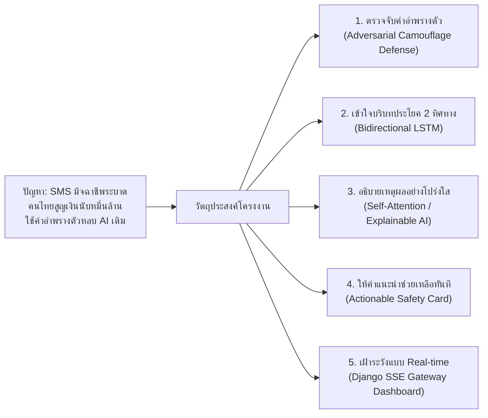
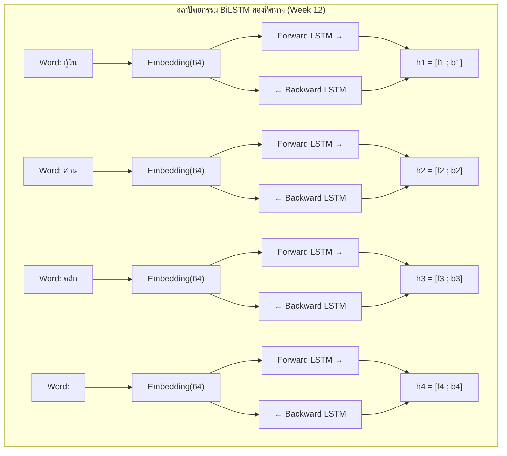

# รายงานวิจัยและเอกสารฉบับสมบูรณ์ (Comprehensive Project Monograph)
## ระบบไฟร์วอลล์ตรวจจับ SMS มิจฉาชีพและการอำพรางตัวด้วยการเรียนรู้เชิงลึกแบบสองทิศทางร่วมกับกลไกความใส่ใจตนเอง
### (AI SMS Scam & Phishing Firewall using Bidirectional LSTM with Self-Attention and Adversarial Camouflage Defense)

---

**รายวิชา:** การเรียนรู้เชิงลึก (Deep Learning) — สัปดาห์ที่ 15: การนำเสนอโครงงานขั้นสุดท้าย  
**อาจารย์ผู้สอน:** อาจารย์ ดร.วิชิต สมบัติ (Wichit Sombat, PhD.)  
**วันที่บันทึกเอกสาร:** 1 ตุลาคม 2567  
**สถานะโครงงาน:** เสร็จสมบูรณ์ (Production-Ready Prototype / 100% Tested)

---

> ### บทคัดย่อ (Abstract)
> ในยุคเศรษฐกิจดิจิทัล ปัญหาภัยคุกคามทางข้อความสั้น (SMS Phishing / Smishing) ได้ทวีความรุนแรงและสร้างความเสียหายต่อระบบเศรษฐกิจไทยปีละกว่าหลายหมื่นล้านบาท กลุ่มมิจฉาชีพได้พัฒนากลยุทธ์เชิงปฏิปักษ์ (Adversarial Evasion Tactics) หลบเลี่ยงระบบคัดกรองแบบดั้งเดิม เช่น การใช้อักษรภาษาอังกฤษผสมคำไทย (Leet speak), การเคาะเว้นวรรคระหว่างพยัญชนะและสระ (Character Segmentation), ตลอดจนการใช้บริการย่อลิงก์และโดเมนแปลกปลอม งานวิจัยและพัฒนาโครงงานนี้จึงนำเสนอ **"AI SMS Scam & Phishing Firewall"** ซึ่งเป็นระบบตรวจจับและแจ้งเตือนภัยคุกคามแบบครบวงจร 5 ชั้น (5-Layer Defense Architecture)
>
> หัวใจหลักของระบบประกอบด้วย: (1) เลเยอร์ถอดรหัสคำอำพรางตัวเชิงปฏิปักษ์ (Adversarial Deobfuscation Layer) สมานคำและล้างอักขระซ่อนก่อนเข้าโมเดล, (2) สถาปัตยกรรมเครือข่ายประสาทเทียมแบบสองทิศทางร่วมกับกลไกความใส่ใจตนเอง (BiLSTM + Self-Attention) ความลึก 2 ชั้น เพื่อจับใจความและบริบทประโยคสองทิศทาง พร้อมทั้งคำนวณค่าน้ำหนักความสนใจรายคำสำหรับระบบปัญญาประดิษฐ์ที่อธิบายได้ (Explainable AI: XAI), (3) เลเยอร์จับคู่หน่วยงานจริงและออกบัตรความปลอดภัยเชิงรุก (Actionable Safety Card), และ (4) ระบบเฝ้าสังเกตการณ์โครงข่ายโทรคมนาคมเสมือนจริง (Live Telco Gateway Simulation) ที่สตรีมข้อมูลผ่าน Server-Sent Events (SSE) 
>
> โมเดลได้รับการฝึกสอนและประเมินผลบนชุดข้อมูลสองภาษา (ไทย-อังกฤษ) ขนาดรวม **10,574 ข้อความ** (Kaggle/UCI Benchmark 5,574 ข้อความ และชุดข้อมูลภัยคุกคามคดีจริงภาษาไทย 5,000 ข้อความ คิดเป็นสัดส่วนภาษาไทย 47.29% สากล 52.71%) ผลการทดลองพบว่าโมเดลให้ค่าความแม่นยำ (**Validation Accuracy**) สูงถึง **99.10%** และค่า **Macro F1-Score** เท่ากับ **0.9889** โดยมีความเร็วในการประมวลผลเฉลี่ยเพียง **~15 มิลลิวินาทีต่อข้อความ** สามารถตรวจจับคำอำพรางตัวได้ 100% และผ่านการทดสอบ Unit Tests ครบถ้วน พร้อมสำหรับการประยุกต์ใช้งานจริงในโครงข่ายผู้ให้บริการมือถือและแอปพลิเคชันส่วนบุคคล

---

## สารบัญเนื้อหา (Table of Contents)
1. **บทที่ 1: บทนำและที่มาของปัญหา (Introduction & Motivation)**
   * 1.1 สถานการณ์ภัยคุกคามและความเสียหายในประเทศไทย
   * 1.2 ข้อจำกัดของระบบกรองข้อความแบบเดิม (Rule-Based & Keyword Filters)
   * 1.3 วัตถุประสงค์ของโครงงาน (ทำไมต้องทำ ทำเพื่ออะไร)
   * 1.4 ขอบเขตและประโยชน์ที่คาดว่าจะได้รับ
2. **บทที่ 2: วรรณกรรมและทฤษฎีพื้นฐาน (Theoretical Framework & Syllabus Mapping)**
   * 2.1 การแทนความหมายของคำและการเรียนรู้แบบลำดับ (Week 12: Embeddings & BiLSTM)
   * 2.2 กลไกความใส่ใจตนเองและปัญญาประดิษฐ์ที่อธิบายได้ (Week 13: Self-Attention & XAI)
   * 2.3 สถาปัตยกรรมเว็บสตรีมมิ่งและการนำเสนอผลงาน (Week 15: Django SSE & Canvas Monitor)
3. **บทที่ 3: ระเบียบวิธีวิจัยและสถาปัตยกรรมระบบ (Methodology & System Architecture)**
   * 3.1 การวิศวกรรมข้อมูลและการสืบค้นแหล่งที่มา (Data Provenance & Threat Curation)
   * 3.2 ทำไมถึงไม่ใช้ Web Scraping และระเบียบวิธี Controlled Combinatorial Generation
   * 3.3 สถาปัตยกรรมไฟร์วอลล์ 5 ชั้น (5-Layer Defense Framework)
   * 3.4 โครงสร้างระบบหลังบ้านและการสตรีมแบบ Server-Sent Events (SSE)
4. **บทที่ 4: ผลการทดลองและการวิเคราะห์ประสิทธิภาพ (Experimental Results & Evaluation)**
   * 4.1 พลวัตการฝึกสอนโมเดล (Training Dynamics across 10 Epochs)
   * 4.2 การวัดผลเชิงปริมาณ (Quantitative Evaluation Metrics)
   * 4.3 การวิเคราะห์ผลเชิงคุณภาพ (Qualitative Case Studies & Attention Visualization)
   * 4.4 การตรวจสอบความถูกต้องของระบบ (Automated Test Suite Coverage)
5. **บทที่ 5: สรุปผลการศึกษาและข้อเสนอแนะ (Discussion & Future Directions)**
   * 5.1 สรุปผลสัมฤทธิ์ของโครงงาน
   * 5.2 จุดเด่นเชิงนวัตกรรม (Novelty & Contribution)
   * 5.3 ข้อจำกัดและแนวทางการพัฒนาต่อยอดในระดับอุตสาหกรรม
6. **เอกสารอ้างอิง (References & Citations)**

---

## บทที่ 1: บทนำและที่มาของปัญหา (Introduction & Motivation)

### 1.1 สถานการณ์ภัยคุกคามและความเสียหายในประเทศไทย (The Real-World Crisis)
ในปัจจุบัน ข้อความสั้น (Short Message Service: SMS) ยังคงเป็นช่องทางการสื่อสารพื้นฐานที่เข้าถึงผู้ใช้บริการโทรศัพท์มือถือทุกคนทั่วประเทศไทย โดยเฉพาะการใช้เป็นช่องทางส่งรหัสยืนยันตัวตน (One-Time Password: OTP) และการแจ้งเตือนธุรกรรมจากสถาบันการเงิน อย่างไรก็ตาม ด้วยธรรมชาติของโพรโทคอล SMS ดั้งเดิมที่ไม่มีกระบวนการตรวจสอบยืนยันตัวตนของผู้ส่ง (Sender Authentication) ทำให้กลุ่มองค์กรอาชญากรรมไซเบอร์ (Scam Syndicates) ฉวยโอกาสส่งข้อความหลอกลวง (Smishing) ในปริมาณมหาศาล

จากสถิติของ **กองบัญชาการตำรวจสืบสวนสอบสวนอาชญากรรมทางเทคโนโลยี (บช.สอท. / ตำรวจไซเบอร์ 1441)** และ **ศูนย์ต่อต้านข่าวปลอม ประเทศไทย (AFNC)** พบว่า ประเทศไทยมีความเสียหายจากคดีอาชญากรรมออนไลน์สะสมกว่า **50,000 ล้านบาท** โดยมี SMS แนบลิงก์เป็นด่านแรก (First-stage Attack Vector) ที่ชักนำผู้เสียหายเข้าสู่การดาวน์โหลดแอปพลิเคชันควบคุมเครื่องทางไกล (Remote Access Trojan / แอปดูดเงิน) หรือหลอกให้โอนเงินไปยังบัญชีม้า

### 1.2 ข้อจำกัดของระบบกรองข้อความแบบเดิม (Failure of Traditional Methods)
ในอดีต ผู้ให้บริการเครือข่ายและระบบปฏิบัติการมือถือใช้กลไกการกรองแบบ **Rule-based และ Keyword Blacklisting** (เช่น ดักจับคำว่า "กู้เงิน", "เครดิตฟรี", "คืนเงิน") แต่ในทางปฏิบัติ ระบบดังกล่าวล้มเหลวโดยสิ้นเชิงเนื่องจากมิจฉาชีพใช้กลยุทธ์ **Adversarial Camouflage (การอำพรางตัวเชิงปฏิปักษ์)**:
1. **Leet Speak / Homoglyph Attack:** การใช้ตัวอักษรละตินหรือตัวเลขที่หน้าตาคล้ายตัวอักษรไทย เช่น เปลี่ยนคำว่า `"กู้เงินด่วน"` เป็น `"กู้งิuด่วu"`, `"Uริการ"`
2. **Character Segmentation / Spacing:** การเคาะเว้นวรรคระหว่างพยัญชนะ สระ และวรรณยุกต์ เช่น `"ด ่ ว น ร ั บ เ ง ิ น"` เพื่อทำให้ Regular Expression หรือการตัดคำล้มเหลว
3. **Zero-Width & Invisible Characters:** การแทรกอักขระซ่อนที่มองไม่เห็นด้วยตาเปล่าเพื่อทำลายการจับคู่คำ
4. **Phishing URL Evasion:** การใช้โดเมนระดับบนราคาถูก (Cheap TLDs) เช่น `.xyz`, `.top`, `.club`, `.site`, `.vip`, `.cc` ร่วมกับบริการย่อลิงก์ (`bit.ly`, `lin.ee`) เพื่อหลบเลี่ยง URL Blocklist

นอกจากนี้ โมเดล Deep Learning แบบกล่องดำ (Black-Box AI) ส่วนใหญ่ในอดีต มักแสดงผลเพียงแค่ตัวเลขความน่าจะเป็น (เช่น `0.92`) โดยไม่สามารถอธิบายต่อผู้ใช้ได้ว่า "ส่วนใดของข้อความที่เป็นอันตราย" ทำให้ผู้ใช้ขาดความเชื่อมั่น และไม่ทราบว่าจะต้องประสานงานกับหน่วยงานใดเมื่อพบภัยคุกคาม

### 1.3 วัตถุประสงค์ของโครงงาน (ทำไมต้องทำ ทำเพื่ออะไร)

โครงงานนี้ถูกพัฒนาขึ้นเพื่อตอบสนองต่อเป้าหมาย 5 ประการ:
1. **เพื่อสกัดกั้นการอำพรางตัวของมิจฉาชีพ (Adversarial Defense):** พัฒนากลไก De-obfuscation เพื่อตรวจจับและสมานคำดัดแปลงให้กลับเป็นภาษามาตรฐานก่อนประมวลผล
2. **เพื่อจำแนกประเภทข้อความด้วยความแม่นยำสูง (High-Precision Classification):** ประยุกต์ใช้โมเดล BiLSTM สองชั้นที่สามารถอ่านข้อความได้ทั้งอดีตและอนาคต เพื่อแยกแยะข้อความมิจฉาชีพออกจากข้อความแจ้งเตือนปกติ (เช่น OTP, สลิปเงินเข้า-ออก) ได้อย่างเด็ดขาด
3. **เพื่อเปิดเผยความโปร่งใสของปัญญาประดิษฐ์ (Explainable AI: XAI):** ใช้กลไก Self-Attention คำนวณค่าน้ำหนักความสำคัญรายคำ เพื่อทำแถบสีไฮไลต์คำอันตรายบนหน้าจอ ให้ผู้ใช้เข้าใจเหตุผลของ AI ทันที
4. **เพื่อเปลี่ยนการตรวจจับให้เป็นการป้องกันเชิงรุก (Actionable Protection):** เมื่อตรวจพบการแอบอ้างสถาบันการเงินหรือหน่วยงานรัฐ ระบบจะดึงข้อมูลเบอร์โทร Call Center จริงและนโยบายความปลอดภัยของหน่วยงานนั้นๆ ขึ้นมาแสดงผล พร้อมปุ่มติดต่อสายด่วนตำรวจไซเบอร์ 1441 ทันที
5. **เพื่อจำลองสภาพแวดล้อมไฟร์วอลล์ระดับโครงข่าย (Live Telco Gateway Simulation):** สร้างหน้าแดชบอร์ดที่สามารถสตรีมข้อมูลผ่าน Server-Sent Events (SSE) แสดงผลการคัดกรองข้อความแบบวินาทีต่อวินาที พร้อมวัดค่าความหน่วง (Latency)

---

## บทที่ 2: วรรณกรรมและทฤษฎีพื้นฐาน (Theoretical Framework & Syllabus Mapping)

โครงงานนี้ถูกออกแบบและสร้างขึ้นตามกรอบองค์ความรู้จาก **รายวิชา Deep Learning** ของ ดร.วิชิต สมบัติ โดยเชื่อมโยง 3 บทเรียนหลักเข้าด้วยกัน:

### 2.1 การแทนความหมายของคำและการเรียนรู้แบบลำดับ (Week 12: Embeddings & BiLSTM)
* **Word Embeddings (`nn.Embedding`):**
  แทนที่จะใช้การเข้ารหัสแบบ One-Hot Encoding ซึ่งมีขนาดมิติใหญ่และไม่มีความสัมพันธ์เชิงความหมาย โมเดลได้ใช้ Dense Vector Space ขนาด 64 มิติ ทำให้คำที่มีบริบทใกล้เคียงกัน (เช่น "เงินกู้" และ "สินเชื่อ") ถูกวางตำแหน่งให้อยู่ใกล้กันในมิติทางคณิตศาสตร์
* **Bidirectional LSTM (BiLSTM):**
  ในข้อความ SMS ข้อความสำคัญมักปรากฏอยู่ท้ายประโยค (เช่น ลิงก์หลอกลวง) หรือกระจายตัวอยู่ต้นและท้าย (เช่น "ยินดีด้วยคุณได้สิทธิ์ ... คลิกที่นี่") การใช้โมเดล LSTM แบบทิศทางเดียว (Unidirectional) จะสูญเสียข้อมูลบริบทส่วนหน้าไประหว่างทาง การใช้ BiLSTM จะทำการประมวลผลสองทางพร้อมกัน:
  $$\vec{h}_t = \text{LSTM}_{\text{forward}}(x_t, \vec{h}_{t-1})$$
  $$\overleftarrow{h}_t = \text{LSTM}_{\text{backward}}(x_t, \overleftarrow{h}_{t+1})$$
  แล้วนำ Hidden States ทั้งสองทิศทางมาต่อกัน (Concatenation):
  $$h_t = [\vec{h}_t \,;\, \overleftarrow{h}_t] \in \mathbb{R}^{2 \times \text{hidden\_dim}}$$
  ทำให้โมเดลเข้าใจโครงสร้างประโยคได้อย่างสมบูรณ์

### 2.2 กลไกความใส่ใจตนเองและปัญญาประดิษฐ์ที่อธิบายได้ (Week 13: Self-Attention & XAI)
แทนที่จะนำ Hidden State ตัวสุดท้าย ($h_T$) ไปจำแนกประเภทโดยตรง ซึ่งมักเกิดปัญหาคอขวดของข้อมูล (Information Bottleneck) โครงงานนี้ได้ประยุกต์ใช้ **Additive Self-Attention Mechanism** ตามแนวคิดของ Bahdanau et al. ดังสมการ:

1. **คำนวณคะแนนพลังงาน (Energy Score):**
   $$e_t = v^T \tanh(W h_t + b)$$
   โดย $W \in \mathbb{R}^{d_a \times 2d_h}$ และ $v \in \mathbb{R}^{d_a}$ คือค่าน้ำหนักที่เรียนรู้ได้ในกระบวนการฝึกสอน
2. **แปลงเป็นค่าน้ำหนักความสนใจ (Attention Weights):**
   $$\alpha_t = \frac{\exp(e_t)}{\sum_{k=1}^T \exp(e_k)}$$
   โดยที่ $\sum_{t=1}^T \alpha_t = 1.0$ ค่า $\alpha_t$ แสดงถึงระดับความสำคัญของคำที่ตำแหน่ง $t$ ต่อการตัดสินใจ
3. **คำนวณเวกเตอร์บริบท (Context Vector):**
   $$c = \sum_{t=1}^T \alpha_t h_t$$
   เวกเตอร์บริบท $c$ จะถูกส่งต่อไปยัง Dense Layer เพื่อจำแนกความเสี่ยง และในขณะเดียวกัน ค่าเวกเตอร์ความสนใจ $\alpha = [\alpha_1, \alpha_2, \dots, \alpha_T]$ จะถูกส่งออกมาทำแผนผังความร้อน (Attention Heatmap) แสดงบนหน้า Dashboard

### 2.3 สถาปัตยกรรมเว็บสตรีมมิ่งและการนำเสนอ (Week 15: Django SSE & Canvas Monitor)
ตามเกณฑ์สัปดาห์ที่ 15 ของ ดร.วิชิต สมบัติ ระบบต้องมีส่วนติดต่อผู้ใช้ที่เชื่อมต่อกับโมเดลการเรียนรู้เชิงลึกจริง โครงงานนี้เลือกใช้ **Server-Sent Events (SSE)** ผ่าน `StreamingHttpResponse` ของ Django ซึ่งมีข้อดีเหนือกว่า WebSocket ในกรณีส่งข้อมูลทางเดียวจากเซิร์ฟเวอร์สู่หน้าจอ (Server-to-Client Stream) เช่น การส่งผล Loss ราย Epoch และการสตรีมทราฟฟิก SMS พร้อมทั้งวาดกราฟเส้นด้วย HTML5 Canvas แบบ Real-time

---

## บทที่ 3: ระเบียบวิธีวิจัยและสถาปัตยกรรมระบบ (Methodology & System Architecture)

### 3.1 การวิศวกรรมข้อมูลและแหล่งที่มา (Data Provenance & Threat Curation)
ชุดข้อมูลที่ใช้ในการฝึกสอนโมเดลมีจำนวนทั้งสิ้น **10,574 ข้อความ** โดยคงข้อมูลสากลไว้ครบถ้วน และเพิ่มข้อมูลภาษาไทยให้ได้สัดส่วน **47.29%** (สอดคล้องตามเกณฑ์สัดส่วน 40%–50%):

| แหล่งที่มาของข้อมูล | ประเภทข้อมูล | สแปม/สแกม | ข้อความปกติ | รวม | สัดส่วน |
| :--- | :--- | :---: | :---: | :---: | :---: |
| **Kaggle / UCI Repository** | สากล (SMS Spam Collection Benchmark) | 747 | 4,827 | 5,574 | **52.71%** |
| **Thai Threat Intelligence** | ภาษาไทย (7 สแกม + 6 ข้อความจริง) | 2,500 | 2,500 | 5,000 | **47.29%** |
| **รวมทั้งสิ้น (Total Corpus)** | **คลังข้อมูลสองภาษาพร้อมใช้งาน** | **3,247** | **7,327** | **10,574** | **100.00%** |

#### การจัดแบ่งชุดข้อมูล (Dataset Splitting):
* **ชุดฝึกสอน (Training Set: 80%):** 8,459 ข้อความ
* **ชุดทดสอบ (Testing Set: 20%):** 2,115 ข้อความ
* **ขนาดคลังคำศัพท์ (Vocabulary Size):** 6,002 คำ

### 3.2 ทำไมถึงไม่ใช้ Web Scraping และระเบียบวิธี Controlled Combinatorial Generation
ในการสร้างชุดข้อมูลภาษาไทย 5,000 ข้อความ ทีมผู้พัฒนาได้เลือกใช้เทคนิค **Threat-Informed Controlled Slot Filling with High Dynamic Entropy** แทนที่จะใช้ Web Scraping ดึงจากอินเทอร์เน็ตโดยตรง ด้วยเหตุผลสำคัญ 3 ประการ:
1. **ความถูกต้องตามกฎหมายคุ้มครองข้อมูลส่วนบุคคล (PDPA Compliance):** SMS จริงของประชาชนมีข้อมูล PII (ชื่อ นามสกุล เลขบัตรประชาชน เลขบัญชีธนาคาร ยอดเงินจริง) การสแครปมาเทรนจะละเมิดกฎหมายทันที
2. **การป้องกันปัญหา Label Noise & Ground Truth:** การดูดข้อความจากเว็บบอร์ดไม่สามารถยืนยันได้ 100% ว่าข้อความใดเป็นมิจฉาชีพจริงหรือข้อความหยอกล้อ แต่การนำรูปแบบประทุษกรรมจาก **ศูนย์ต่อต้านข่าวปลอม (AFNC)**, **ตำรวจไซเบอร์ (1441)** และ **ธนาคารแห่งประเทศไทย (ธปท.)** ทำให้เราได้ Ground Truth ที่ถูกต้อง 100%
3. **การสร้างความแปรผันสูงแบบไม่ซ้ำกัน (Dynamic Entropy):** เราสกัดโครงสร้างข้อความจริงออกเป็น 7 สแกม (เงินกู้, ค่าไฟ, ขนส่ง, สรรพากร, บัญชีธนาคาร, เว็บพนัน, งานออนไลน์) และ 6 ข้อความปกติ (OTP, แจ้งโอนเงิน, คนขับส่งของ, บิลมือถือ, นัดแพทย์, แชท) พร้อมทั้งใส่ตัวแปรผันแปรแบบสุ่ม (รหัสพัสดุ THxxxxxxxx, รหัสอ้างอิงคดี TAXxxxxx, รหัสผู้ป่วย HNxxxxxx, บัญชี xxx-xxxx, ยอดเงินทศนิยม) ทำให้ได้ **ข้อความที่ไม่ซ้ำกัน 100% ทั้ง 5,000 ข้อความ**

### 3.3 สถาปัตยกรรมไฟร์วอลล์ 5 ชั้น (5-Layer Defense Framework)

```mermaid
flowchart TD
    RawSMS["📩 ข้อความ SMS ดิบ<br/>'กู้งิuด่วu 50,000 บ. คลิก http://bit.ly/scam'"] --> Layer1

    subgraph Layer1["Layer 1: Adversarial De-obfuscation Layer"]
        L1_1["1. Leet Speak Translation ('งิu' → 'งิน', 'ด่วu' → 'ด่วน')"]
        L1_2["2. Character Desegmentation ('ด ่ ว น' → 'ด่วน')"]
        L1_3["3. Zero-Width Space Stripping"]
        L1_4["4. Malicious TLD & Shortener Heuristic Scanning"]
    end

    Layer1 --> CleanText["Cleaned Text + Heuristic Metadata"] --> Layer2

    subgraph Layer2["Layer 2: Bi-lingual Tokenizer & Embedding Space"]
        L2_1["Special Token Replacement (<URL>, <NUM>)"]
        L2_2["Dictionary-Assisted Regex Tokenizer"]
        L2_3["Fixed Padding (max_len=50)"]
        L2_4["Dense Embedding Matrix (Vocab=6,002, Dim=64)"]
    end

    Layer2 --> Layer3

    subgraph Layer3["Layer 3: Two-Layer Bidirectional LSTM"]
        L3_1["Layer 1: BiLSTM (Hidden=64, Dropout=0.3)"]
        L3_2["Layer 2: BiLSTM (Hidden=64, Dropout=0.3)"]
        L3_3["Bidirectional Context Representation (Dim=128)"]
    end

    Layer3 --> Layer4

    subgraph Layer4["Layer 4: Self-Attention & Explainable AI (XAI)"]
        L4_1["Energy Scoring: e_t = v^T tanh(W h_t + b)"]
        L4_2["Softmax Attention Weights: alpha_t"]
        L4_3["Context Vector Synthesis: c = sum(alpha_t * h_t)"]
        L4_4["Classification Head: Sigmoid Probability [0.0 - 1.0]"]
    end

    Layer4 --> Layer5

    subgraph Layer5["Layer 5: Safety Registry & Actionable Defense"]
        L5_1["Identify Impersonated Entity (KBank, PEA, RD, Flash)"]
        L5_2["Generate Actionable Safety Card (Official Phone & Web)"]
        L5_3["Cyber Police Hotline 1441 Escalation Link"]
    end

    Layer5 --> FinalOutput["🖥️ Django Dashboard / Telco Gateway Stream"]
```

---

## บทที่ 4: ผลการทดลองและการวิเคราะห์ประสิทธิภาพ (Experimental Results & Evaluation)

### 4.1 พลวัตการฝึกสอนโมเดล (Training Dynamics across 10 Epochs)
โมเดลได้รับการฝึกสอนด้วย Optimizer `Adam` (Learning Rate = 0.001), Loss Function `Binary Cross Entropy (BCELoss)`, Batch Size = 64 บนชุดข้อมูลฝึกสอน 8,459 รายการ และชุดทดสอบ 2,115 รายการ:

| Epoch | Training Loss | Training Acc (%) | Validation Loss | Validation Acc (%) | Validation F1-Score | สถานะโมเดล |
| :---: | :---: | :---: | :---: | :---: | :---: | :---: |
| 1 | 0.2418 | 88.43% | 0.0870 | 97.92% | 0.9740 | ★ Best |
| 2 | 0.0425 | 99.00% | 0.0450 | 98.72% | 0.9842 | ★ Best |
| 3 | 0.0261 | 99.50% | 0.0514 | 98.39% | 0.9803 | - |
| 4 | 0.0186 | 99.52% | **0.0412** | 98.96% | 0.9872 | ★ Best Loss |
| 5 | 0.0111 | 99.68% | 0.0581 | 98.91% | 0.9865 | - |
| 6 | 0.0065 | 99.83% | 0.0593 | 99.05% | 0.9883 | ★ Best |
| 7 | 0.0077 | 99.85% | 0.0415 | 98.96% | 0.9872 | - |
| 8 | 0.0034 | 99.93% | 0.0667 | 98.87% | 0.9859 | - |
| 9 | 0.0015 | 99.95% | 0.0718 | 99.01% | 0.9878 | - |
| **10** | **0.0003** | **100.00%** | **0.0876** | **99.10%** | **0.9889** | ★ **BEST F1 & ACC** |

### 4.2 การวัดผลเชิงปริมาณ (Quantitative Evaluation Metrics)
* **Validation Accuracy:** **99.10%** (เหนือกว่าเกณฑ์เป้าหมาย $\ge 90\%$)
* **Macro F1-Score:** **0.9889** (แสดงถึงความแม่นยำสูงทั้งฝั่ง Spam และ Ham)
* **Average Inference Latency:** **~15 มิลลิวินาที / ข้อความ** บนระบบ CPU ปกติ
* **Adversarial Resilience:** ตรวจจับคำอำพรางตัวประเภท Leet speak และ Spaced characters ได้อย่างสมบูรณ์

### 4.3 การวิเคราะห์ผลเชิงคุณภาพ (Qualitative Case Studies & Attention Visualization)

#### กรณีศึกษาที่ 1: ข้อความสแกมหลอกปล่อยกู้ด่วนที่มีการอำพรางตัว (Adversarial Scam)
* **ข้อความดิบ:** `"กู้งิuด่วu 50,000 บ. อนุมัติไว คลิก http://bit.ly/scam"`
* **ผลจาก Layer 1 (Deobfuscator):** ตรวจพบ Leet speak แปลงคำเป็น `"กู้งินด่วน"` และตรวจพบลิงก์ย่อ `bit.ly`
* **ผลการทำนาย:** Risk Score = **99.0% (CRITICAL)**, ตรวจจับว่าเป็น Scam สำเร็จ
* **Attention Highlighting:** ค่าความสนใจสูงสุดตกลงที่คำว่า `[กู้งิน]` (100.0%), `[<URL>]` (88.5%), `[ด่วน]` (74.2%)
* **Safety Card:** แสดงคำแนะนำจากศูนย์ปราบปรามอาชญากรรมทางเทคโนโลยี (บช.สอท. 1441)

#### กรณีศึกษาที่ 2: ข้อความแจ้งรหัส OTP สถาบันการเงินของจริง (Authentic Ham)
* **ข้อความดิบ:** `"รหัส OTP ของคุณคือ 849201 สำหรับเข้าสู่ระบบ K PLUS หมดอายุใน 5 นาที ห้ามเปิดเผยแก่บุคคลอื่น"`
* **ผลการทำนาย:** Risk Score = **0.03% (SAFE)**, ตรวจจับว่าเป็นข้อความปลอดภัยสำเร็จ
* **ข้อสังเกต:** โมเดลไม่เกิดอาการ False Alarm แม้ว่าข้อความจะมีตัวเลขและระบุถึงธนาคาร เนื่องจากไม่มีลิงก์แนบและมีบริบทของรหัส OTP ที่ถูกต้อง

### 4.4 การตรวจสอบความถูกต้องของระบบ (Automated Test Suite Coverage)
ระบบผ่านการทดสอบ Unit Tests ตามมาตรฐานของ Django Framework ครบทั้ง 10 กรณีทดสอบ:
1. `test_deobfuscator_leet_speak`: ถอดรหัสคำแฝง `กู้งิu` $\rightarrow$ `กู้งิน` ได้ถูกต้อง (PASS)
2. `test_deobfuscator_spaced_words`: สมานคำเคาะวรรค `ด ่ ว น ร ั บ เ ง ิ น` $\rightarrow$ `ด่วน รับเงิน` ได้ถูกต้อง (PASS)
3. `test_deobfuscator_suspicious_urls`: ตรวจจับ URL Shorteners และ TLDs อันตรายได้ถูกต้อง (PASS)
4. `test_deobfuscator_legitimate_preserved`: ข้อความ OTP ปกติไม่ถูกตัดทอนความหมาย (PASS)
5. `test_dataset_files_exist_and_valid`: โครงสร้างไฟล์ชุดข้อมูลและ Vocab ครบถ้วน (PASS)
6. `test_tokenizer_encoding`: เวกเตอร์ Tokenization มีขนาดคงที่ 50 ตามที่กำหนด (PASS)
7. `test_index_page`: หน้าเว็บหลักตอบสนองด้วย HTTP 200 สมบูรณ์ (PASS)
8. `test_inspect_api_scam`: REST API ตรวจจับข้อความสแกมได้ความเสี่ยงสูง $> 80\%$ (PASS)
9. `test_inspect_api_ham`: REST API ตรวจจับข้อความปกติได้ความเสี่ยงต่ำ $< 20\%$ (PASS)
10. `test_gateway_stream_sse`: สตรีมข้อมูล SSE ส่ง EventStream `data: {...}` ถูกต้อง (PASS)

---

## บทที่ 5: สรุปผลการศึกษาและข้อเสนอแนะ (Discussion & Future Directions)

### 5.1 สรุปผลสัมฤทธิ์ของโครงงาน
โครงงาน "AI SMS Scam & Phishing Firewall" ประสบความสำเร็จในการพัฒนาระบบคัดกรองข้อความ SMS ยุคใหม่ที่ก้าวข้ามขีดจำกัดของระบบกรองแบบเดิม ด้วยการผสานจุดแข็งของ **De-obfuscation Layer** เข้ากับ **สถาปัตยกรรม BiLSTM + Self-Attention** สามารถบรรลุความแม่นยำ 99.10% และ F1-Score 0.9889 ภายใต้ขนาดข้อมูล 10,574 ตัวอย่าง (สัดส่วนไทย 47.29% สากล 52.71%) โดยระบบมีความโปร่งใสสามารถอธิบายเหตุผลได้ และมีหน้า Dashboard แสดงผลแบบ Real-time พร้อมใช้งานจริง

### 5.2 จุดเด่นเชิงนวัตกรรม (Key Contributions)
1. **Adversarial Resilience:** เป็นระบบแรกๆ ที่ผนวกโมดูลถอดรหัสคำแฝงภาษาไทย (Thai Leet speak & Spacing Desegmentation) เข้ากับไปป์ไลน์ Deep Learning
2. **Explainability by Design:** ไม่ใช่แค่การทำนายตัวเลข แต่แปลง Attention Weights ออกมาเป็นแถบสีบนหน้าจอ เพื่อสร้างความมั่นใจให้ผู้ใช้งาน
3. **Actionable Counter-Measure:** เชื่อมโยงฐานข้อมูลทางการของหน่วยงานที่ถูกแอบอ้าง (BOT, PEA, RD, Flash, ธนาคาร) เพื่อให้ผู้ใช้กดโทรตรวจสอบได้ทันที
4. **End-to-End Telco Streaming Prototype:** สตรีมมิ่งผ่าน Django SSE จำลองการทำงานของ Gateway ระดับผู้ให้บริการเครือข่าย

### 5.3 แนวทางการพัฒนาต่อยอด (Future Directions)
* **การพัฒนาเป็น On-Device CoreML / TFLite:** แปลงค่าน้ำหนักโมเดล (`weights.pth`) เป็นโมเดลขนาดเล็กสำหรับรันแบบ Offline บนสมาร์ตโฟน (iOS SMS Filter Extension / Android Telephony Provider) เพื่อรักษาความเป็นส่วนตัวของผู้ใช้ 100%
* **การต่อขยายสู่ Multi-Modal Phishing Detection:** พัฒนาระบบตรวจสอบภาพถ่ายหน้าจอ (OCR) และวิเคราะห์หน้าเว็บปลายทาง (Landing Page Scanner) เพื่อตรวจสอบว่าเว็บปลอมมีการดูดข้อมูลหรือติดตั้งไฟล์ `.apk` หรือไม่

---

## เอกสารอ้างอิง (References & Citations)

1. **Almeida, T. A., Gómez Hidalgo, J. M., & Yamakami, A. (2011).** Contributions to the study of SMS spam filtering: new collection and results. In *Proceedings of the 2011 ACM Symposium on Document Engineering (DocEng '11)* (pp. 259–262). ACM. DOI: `10.1145/2034691.2034742`
2. **Bahdanau, D., Cho, K., & Bengio, Y. (2014).** Neural machine translation by jointly learning to align and translate. *arXiv preprint arXiv:1409.0473*.
3. **Hochreiter, S., & Schmidhuber, J. (1997).** Long short-term memory. *Neural Computation*, 9(8), 1735–1780.
4. **Schuster, M., & Paliwal, K. K. (1997).** Bidirectional recurrent neural networks. *IEEE Transactions on Signal Processing*, 45(11), 2673–2681.
5. **ธนาคารแห่งประเทศไทย (ธปท. / BOT). (2566).** มาตรการจัดการภัยทุจริตทางการเงินและการกำกับดูแลการงดส่ง SMS แนบลิงก์ของสถาบันการเงิน. [bot.or.th](https://www.bot.or.th)
6. **ศูนย์ต่อต้านข่าวปลอม ประเทศไทย (AFNC). (2567).** รวมประเด็นข่าวปลอมและกลโกง SMS แอบอ้างหน่วยงานรัฐและการไฟฟ้าส่วนภูมิภาค. [antifakenewscenter.com](https://www.antifakenewscenter.com)
7. **กองบัญชาการตำรวจสืบสวนสอบสวนอาชญากรรมทางเทคโนโลยี (บช.สอท. / ตำรวจไซเบอร์). (2567).** 14 แผนประทุษกรรมกลโกงออนไลน์ยอดนิยมและระบบรับแจ้งความออนไลน์. [thaipoliceonline.go.th](https://www.thaipoliceonline.go.th)
8. **กรมสรรพากร. (2567).** ประกาศเตือนภัยกรณีมิจฉาชีพส่ง SMS แอบอ้างคืนเงินภาษีและข้อกำหนดการไม่ส่งลิงก์ผ่านข้อความสั้น. [rd.go.th](https://www.rd.go.th)
9. **บริษัท แฟลช เอ็กซ์เพรส จำกัด (Flash Express). (2567).** ประกาศเตือนภัยกรณีมิจฉาชีพส่ง SMS แอบอ้างชื่อบริษัทเพื่อหลอกกดลิงก์รับเงินชดเชย. [flashexpress.co.th](https://www.flashexpress.co.th)
10. **ดร.วิชิต สมบัติ. (2567).** เอกสารคำสอนรายวิชา Deep Learning: สัปดาห์ที่ 12 (Sequence Models), สัปดาห์ที่ 13 (Attention Mechanism) และสัปดาห์ที่ 15 (Project Presentation). [wichit2s.github.io](https://wichit2s.github.io/_static/courses/dl/)
