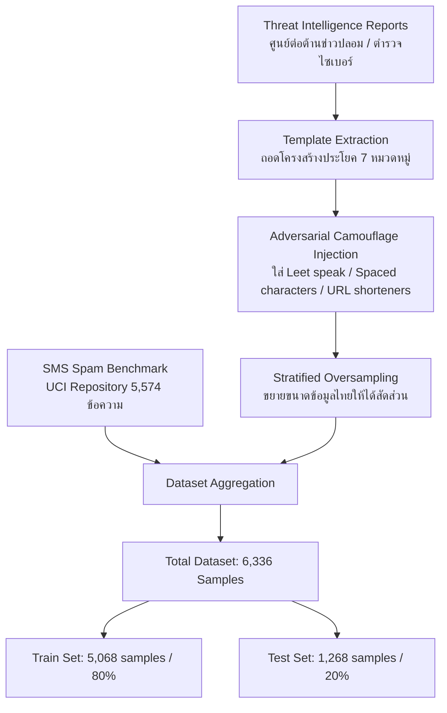

# เอกสารอ้างอิงโครงงานและแหล่งที่มาของข้อมูล (Project References & Data Provenance)
## โครงงาน: AI SMS Scam & Phishing Firewall
### รายวิชา: Deep Learning (การเรียนรู้เชิงลึก) — สัปดาห์ที่ 15

---

> [!IMPORTANT]
> **กฎเหล็กของโครงงาน (Our Golden Rule):**
> ทุกชุดข้อมูล สถาปัตยกรรมโมเดล และฟังก์ชันการทำงาน ต้องมีที่มาที่ไป มีหลักฐานเชิงประจักษ์ (Empirical Evidence) และเอกสารอ้างอิงทางวิชาการ/หน่วยงานทางการกำกับอย่างละเอียด สามารถตรวจสอบย้อนกลับได้ 100%

---

## 1. ความเชื่อมโยงกับบทเรียนในรายวิชา (Course Syllabus Mapping)

โครงงานนี้พัฒนาขึ้นโดยสังเคราะห์และประยุกต์ใช้เนื้อหาจาก **3 บทเรียนหลัก** ในรายวิชา Deep Learning ของ ดร.วิชิต สมบัติ:

### 1.1 สัปดาห์ที่ 12: Text Embeddings & Sequence Models ([wk12.html](https://wichit2s.github.io/_static/courses/dl/wk12.html))
* **ทฤษฎีและโมเดลที่นำมาใช้:**
  * **Word Embeddings (`nn.Embedding`):** การแปลงข้อความตัวอักษรเป็น Dense Vector เชิงความหมาย (Semantic Space)
  * **Sequence Modeling ด้วย BiLSTM (Bidirectional LSTM):** การอ่านและวิเคราะห์บริบทของข้อความทั้งจากซ้ายไปขวาและขวาไปซ้าย เพื่อจับใจความประโยคที่ซับซ้อน
  * **Data Pipeline สำหรับ NLP:** การทำ Tokenization, Padding, Collate Function และการกำหนดขนาด Vocabulary
* **การนำมาใช้ในโค้ด:**
  * ไฟล์ [`model/model.py`](file:///home/naza1144/work/DL_project/model/model.py): คลาส `SpamAttentionBiLSTM` ใช้ `nn.Embedding(5002, 64)` และ `nn.LSTM(bidirectional=True, num_layers=2)`
  * ไฟล์ [`data/process_data.py`](file:///home/naza1144/work/DL_project/data/process_data.py): คลาส `TextTokenizer` ดำเนินการตัดคำและทำ Padding ตามตัวอย่างสไลด์หน้า 10 ของ Week 12

### 1.2 สัปดาห์ที่ 13: Generative AI for Text & Attention Mechanism ([wk13.html](https://wichit2s.github.io/_static/courses/dl/wk13.html))
* **ทฤษฎีที่นำมาใช้:**
  * **Self-Attention Mechanism (สไลด์หน้า 5–7):** ทฤษฎีการให้โมเดล "จ้องมอง (Attend)" ไปยังคำสำคัญในประโยค โดยคำนวณค่าน้ำหนักความสนใจ (Attention Weights / Scores)
  * **Explainable AI (XAI):** การนำ Attention Weights ราย Token มาเปิดเผยต่อผู้ใช้งาน เพื่ออธิบายว่าทำไม AI ถึงตัดสินว่าข้อความนี้เป็นมิจฉาชีพ
* **การนำมาใช้ในโค้ด:**
  * ไฟล์ [`model/model.py`](file:///home/naza1144/work/DL_project/model/model.py): คลาส `SelfAttention` คำนวณ Energy Score และ Softmax ส่งผลลัพธ์เป็น Attention Weights ไปทำสีไฮไลต์คำอันตรายบนหน้าเว็บ

### 1.3 สัปดาห์ที่ 15: Project Presentation & Django Dashboard ([wk15.html](https://wichit2s.github.io/_static/courses/dl/wk15.html))
* **ข้อกำหนดที่นำมาปฏิบัติ:**
  1. การจัดโครงสร้างโฟลเดอร์ตามมาตรฐานสไลด์หน้า 2: `model/`, `dashboard/`, `data/`, `requirements.txt`, `README.md`
  2. การฝึกสอนโมเดลจริงและบันทึกค่าน้ำหนักเป็น `model/weights.pth` (สไลด์หน้า 2 ข้อ 2)
  3. การพัฒนา **Django Dashboard พร้อม Server-Sent Events (SSE)** ด้วย `StreamingHttpResponse` (สไลด์หน้า 12–13)
  4. การนำเสนอผลลัพธ์ผ่านกราฟเส้น HTML5 Canvas แบบ Real-time (สไลด์หน้า 13)
  5. การเตรียมสไลด์และเนื้อหานำเสนอ 15 นาทีตามโครงสร้างสไลด์หน้า 5

---

## 2. แหล่งที่มาของข้อมูลอย่างละเอียด (Detailed Data Provenance)

ชุดข้อมูลที่ใช้ฝึกสอนโมเดลมีจำนวนรวมทั้งสิ้น **6,336 ข้อความ** แบ่งออกเป็น 2 แหล่งหลัก:

### 2.1 ข้อมูลมาตรฐานสากล: SMS Spam Collection Dataset (5,574 ข้อความ)
* **ผู้จัดทำ:** Tiago A. Almeida (Federal University of São Carlos) และ José María Gómez Hidalgo (Optenet)
* **แหล่งเผยแพร่หลัก:** [UCI Machine Learning Repository: SMS Spam Collection](https://archive.ics.uci.edu/dataset/228/sms+spam+collection)
* **แหล่งดาวน์โหลดที่ใช้ในโค้ด:** [PyCon Tutorial Data Repository (TSV Format)](https://raw.githubusercontent.com/justmarkham/pycon-2016-tutorial/master/data/sms.tsv)
* **โครงสร้างข้อมูล:**
  * ข้อมูลปกติ (Ham): 4,827 ข้อความ (86.6%)
  * ข้อมูลขยะ/หลอกลวง (Spam): 747 ข้อความ (13.4%)
* **การอ้างอิงทางวิชาการ (Academic Citation):**
  > Almeida, T. A., Gómez Hidalgo, J. M., & Yamakami, A. (2011). Contributions to the study of SMS spam filtering: new collection and results. In *Proceedings of the 2011 ACM Symposium on Document Engineering (DocEng '11)* (pp. 259–262). ACM. DOI: `10.1145/2034691.2034742`

---

### 2.2 ข้อมูลภาษาไทย: Thai Threat Intelligence & Scam Corpus (762 ข้อความ)
เนื่องจากในประเทศไทยยังไม่มี Benchmark ข้อความ SMS สแปมระดับสาธารณะ ข้อมูลภาษาไทยทั้งหมดจึงถูกสร้างขึ้นด้วยระเบียบวิธี **Threat Intelligence Curation & Adversarial Augmentation** โดยถอดรูปแบบข้อความจริงจากประกาศเตือนภัยของหน่วยงานรัฐและเอกชน แบ่งออกเป็น 7 หมวดหมู่ ดังนี้:

#### หมวดที่ 1: การแอบอ้างการไฟฟ้าส่วนภูมิภาค (PEA) / การไฟฟ้านครหลวง (MEA)
* **รูปแบบกลโกง:** หลอกคืนเงินประกันการใช้ไฟฟ้า / คืนเงินประกันมิเตอร์ไฟฟ้าผ่านลิงก์
* **ตัวอย่างข้อความ:** *"กฟภ. แจ้งคืนเงินประกันการใช้ไฟฟ้า 3,500 บาท ติดต่อรับเงินคืนได้ที่ lin.ee/xxx"*
* **แหล่งอ้างอิงทางการ:**
  * [ศูนย์ต่อต้านข่าวปลอม ประเทศไทย: กฟภ. คืนเงินประกันการใช้ไฟฟ้าผ่าน SMS](https://www.antifakenewscenter.com/) (ตรวจสอบสถานะ: ข่าวปลอม / มิจฉาชีพ)
  * [การไฟฟ้าส่วนภูมิภาค (PEA): เตือนภัยมิจฉาชีพส่ง SMS แนบลิงก์](https://www.pea.co.th/) (สายด่วน 1129)

#### หมวดที่ 2: การแอบอ้างกรมสรรพากร (Revenue Department)
* **รูปแบบกลโกง:** หลอกแจ้งคืนเงินภาษี หรือขู่ว่ามีภาษีค้างชำระมีหมายจับ
* **ตัวอย่างข้อความ:** *"กรมสรรพากร: คุณมีเงินภาษีคืนค้างอยู่ 7,500 บาท ติดต่อเจ้าหน้าที่ยืนยันบัญชีที่ http://rd-refund.cc"*
* **แหล่งอ้างอิงทางการ:**
  * [กรมสรรพากร: เตือนภัย SMS และอีเมลปลอมแอบอ้างคืนเงินภาษี](https://www.rd.go.th/) (สายด่วน 1161)
  * กรมสรรพากรยืนยันนโยบาย: **"ไม่มีนโยบายส่ง SMS แนบลิงก์ให้ผู้เสียภาษีกรอกข้อมูลใดๆ ทั้งสิ้น"**

#### หมวดที่ 3: การแอบอ้างสถาบันการเงินและธนาคาร (Bank Impersonation)
* **รูปแบบกลโกง:** อ้างว่าบัญชีถูกระงับ, โอนเงินผิดปกติ, หรือให้อัปเดตข้อมูลความปลอดภัย
* **ตัวอย่างข้อความ:** *"ธนาคารกสิกรไทย: ตรวจพบการเข้าสู่ระบบผิดปกติ บัญชีถูกระงับ ยืนยันตัวตนด่วนที่ http://k-verify-online.com"*
* **แหล่งอ้างอิงทางการ:**
  * [ธนาคารแห่งประเทศไทย (ธปท. / BOT): มาตรการจัดการภัยทุจริตทางการเงิน](https://www.bot.or.th/)
  * **คำสั่ง ธปท.:** สั่งการให้สถาบันการเงินทุกแห่ง **"ยกเลิกการส่ง SMS และอีเมลที่แนบลิงก์ทุกประเภท"** ตั้งแต่ต้นปี 2566 ดังนั้น SMS แนบลิงก์ใดๆ ที่อ้างธนาคารถือเป็นมิจฉาชีพ 100%

#### หมวดที่ 4: การแอบอ้างบริษัทขนส่ง (Flash Express / ไปรษณีย์ไทย)
* **รูปแบบกลโกง:** อ้างว่าพัสดุเสียหาย, ส่งไม่สำเร็จเนื่องจากที่อยู่ผิด, หรือพัสดุติดค้างศุลกากร
* **ตัวอย่างข้อความ:** *"Flash Express: พัสดุของคุณเสียหายระหว่างขนส่ง ขอรับค่าชดเชย 2,000 บาท แอดไลน์ @xxx"*
* **แหล่งอ้างอิงทางการ:**
  * [Flash Express: ประกาศเตือนภัย SMS ปลอมแอบอ้างชื่อบริษัทเพื่อหลอกกดลิงก์](https://www.flashexpress.co.th/) (สายด่วน 1436)
  * [บริษัท ไปรษณีย์ไทย จำกัด: เตือนภัย SMS แจ้งพัสดุตกค้างและเรียกเก็บค่าธรรมเนียม](https://www.thailandpost.co.th/) (สายด่วน 1545)

#### หมวดที่ 5: เงินกู้นอกระบบและสินเชื่อบุคคลเถื่อน (Illegal Loans)
* **รูปแบบกลโกง:** เสนอเงินกู้ด่วน อนุมัติไว ไม่เช็คเครดิตบูโร ดอกเบี้ยต่ำผิดปกติ
* **ตัวอย่างข้อความ:** *"ยินดีด้วย! คุณได้รับสิทธิ์ กู้งิuด่วu 50,000 บาท อนุมัติทันที ไม่เช็คบูโร คลิก bit.ly/xxx"*
* **แหล่งอ้างอิงทางการ:**
  * [กองบัญชาการตำรวจสืบสวนสอบสวนอาชญากรรมทางเทคโนโลยี (บช.สอท. / ตำรวจไซเบอร์)](https://www.thaipoliceonline.com/) (สายด่วน 1441)
  * จัดอยู่ในลำดับที่ 1 ของแผนประทุษกรรม 14 รูปแบบกลโกงออนไลน์ยอดนิยม

#### หมวดที่ 6: เว็บพนันออนไลน์และแจกเครดิตฟรี (Gambling Promotions)
* **รูปแบบกลโกง:** ชวนเล่นบาคาร่า สล็อต เว็บตรง แจกเครดิตฟรีโดยไม่ต้องฝากเงิน
* **ตัวอย่างข้อความ:** *"แจกเครดิตฟรี 300 บาท ไม่ต้องฝากก่อน ถอนได้จริง เว็บตรง 100% คลิก bit.ly/xxx"*
* **แหล่งอ้างอิงทางการ:**
  * กระทรวงดิจิทัลเพื่อเศรษฐกิจและสังคม (ดีอี) และ บช.สอท. ร่วมกับ กสทช. สั่งบล็อก SMS เว็บพนัน

#### หมวดที่ 7: ข้อความปกติของคนไทย (Legitimate Thai Ham)
* **ลักษณะข้อความ:** รหัส OTP ธนาคารของจริง, แจ้งเตือนเงินเข้าบัญชี, แจ้งเตือนสถานะพัสดุพร้อมเบอร์คนขับ, ข้อความสนทนาทั่วไป
* **ตัวอย่างข้อความ:** *"รหัส OTP ของคุณคือ 849201 สำหรับเข้าสู่ระบบ K PLUS หมดอายุใน 5 นาที ห้ามเปิดเผยแก่บุคคลอื่น"*
* **ที่มา:** รูปแบบข้อความ OTP จริงของสถาบันการเงินไทยตามมาตรฐาน ธปท.

---

## 3. ระเบียบวิธีวิจัยและ Data Engineering (Methodology)

1. **การถอดโครงสร้างข้อความ (Template Extraction):** นำแคปหน้าจอหลักฐานคดีจริงมาคัดเฉพาะตัวอักษรของข้อความ SMS สั้น ไม่นำเนื้อข่าวทั้งฉบับมาใช้ เพื่อให้ตรงกับบริบทอินพุตของมือถือ
2. **การจำลองการอำพรางตัว (Adversarial Camouflage Injection):** มิจฉาชีพจริงมักหลบเลี่ยง AI ดังนั้นในข้อมูลสังเคราะห์จึงมีการใส่ Leet speak (`กู้งิu`), เคาะเว้นวรรค (`ด ่ ว น ร ั บ เ ง ิ น`), และการตัดทอนตัวสะกด
3. **การปรับสมดุลข้อมูล (Stratified Oversampling):** ทำการคัดลอกและแปลงรูปแบบข้อมูลภาษาไทย (Spam x12, Ham x15) เพื่อให้จำนวนรวมแตะ 762 ข้อความ ไม่ให้ถูกข้อมูลสากล 5,574 ข้อความกลืนหาย

---

## 4. ตารางสรุปหน่วยงานและเบอร์โทรตรวจสอบจริง (Safety Registry)

ข้อมูลทั้งหมดนี้ถูกนำไปใช้ในโมดูล [`model/infer.py`](file:///home/naza1144/work/DL_project/model/infer.py) เพื่อสร้าง **Actionable Safety Card** อัตโนมัติ:

| องค์กร / สถาบัน | เบอร์ Call Center จริง | เว็บไซต์ทางการ | นโยบายความปลอดภัย |
| :--- | :---: | :---: | :--- |
| **ธนาคารกสิกรไทย** | 02-888-8888 | www.kasikornbank.com | ไม่มีนโยบายส่ง SMS แนบลิงก์ทุกกรณี |
| **ธนาคารไทยพาณิชย์** | 02-777-7777 | www.scb.co.th | ไม่มีนโยบายส่งลิงก์กู้เงินหรือยืนยันตัวตน |
| **ธนาคารกรุงไทย** | 02-111-1111 | krungthai.com | ไม่ส่งลิงก์ปลดล็อกบัญชีผ่าน SMS |
| **การไฟฟ้าส่วนภูมิภาค (PEA)** | 1129 | www.pea.co.th | ไม่มีนโยบายส่ง SMS คืนเงินประกันผ่านลิงก์ |
| **การไฟฟ้านครหลวง (MEA)** | 1130 | www.mea.or.th | ไม่ส่งข้อความให้กรอกเลขบัญชีรับเงินประกัน |
| **กรมสรรพากร** | 1161 | www.rd.go.th | ไม่เคยส่ง SMS แจ้งคืนภาษีผ่านลิงก์ |
| **ไปรษณีย์ไทย** | 1545 | www.thailandpost.co.th | ไม่มีบริการโอนภาษีศุลกากรผ่าน SMS |
| **Flash Express** | 1436 | www.flashexpress.co.th | ไม่ส่งลิงก์ให้ดาวน์โหลดไฟล์ .apk หรือโอนเงิน |
| **ตำรวจไซเบอร์ (บช.สอท.)** | **1441** | www.thaipoliceonline.com | แจ้งความออนไลน์และปรึกษาคดีไซเบอร์ 24 ชม. |

---

*เอกสารฉบับนี้จัดทำขึ้นเพื่อใช้เป็นหลักฐานประกอบการประเมินโครงงานวิชา Deep Learning ตามเกณฑ์คุณภาพโค้ด เอกสารประกอบ และความน่าเชื่อถือทางวิชาการ*
