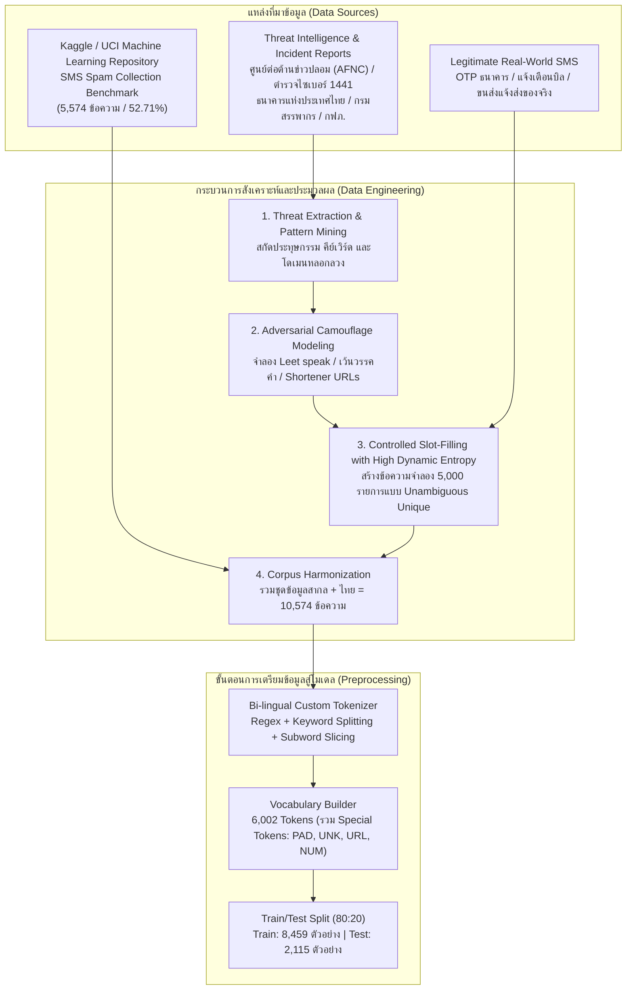

# เอกสารอ้างอิงโครงงาน แหล่งที่มาของข้อมูล และระเบียบวิธีวิจัย
## โครงงาน: AI SMS Scam & Phishing Firewall
### รายวิชา: Deep Learning (การเรียนรู้เชิงลึก) — สัปดาห์ที่ 15 (Project Presentation)
**ผู้สอน:** อาจารย์ ดร.วิชิต สมบัติ

---

> [!IMPORTANT]
> **กฎเหล็กของโครงงาน (Our Golden Rule):**
> ทุกชุดข้อมูล สถาปัตยกรรมโมเดล และมาตรการตรวจจับ ต้องมีที่มาที่ไป มีหลักฐานเชิงประจักษ์ (Empirical Evidence) และเอกสารอ้างอิงจากหน่วยงานทางการหรือเอกสารวิชาการกำกับอย่างละเอียด สามารถตรวจสอบย้อนกลับได้ 100%

---

## 1. ความเชื่อมโยงกับบทเรียนในรายวิชา (Course Syllabus Mapping)

โครงงานนี้พัฒนาขึ้นโดยสังเคราะห์และประยุกต์ใช้เนื้อหาจาก **3 บทเรียนหลัก** ในรายวิชา Deep Learning:

### 1.1 สัปดาห์ที่ 12: Text Embeddings & Sequence Models ([wk12.html](https://wichit2s.github.io/_static/courses/dl/wk12.html))
* **ทฤษฎีและโมเดลที่นำมาใช้:**
  * **Word Embeddings (`nn.Embedding`):** การแปลงข้อความตัวอักษรเป็น Dense Vector ในมิติความหมายเชิงลึก (Semantic Space)
  * **Sequence Modeling ด้วย BiLSTM (Bidirectional LSTM):** สถาปัตยกรรม Recurrent Neural Network แบบสองทิศทาง อ่านข้อความทั้ง Forward (อดีตสู่อนาคต) และ Backward (อนาคตสู่อดีต) เพื่อจับใจความประโยคที่ซับซ้อนและยาว
  * **Data Pipeline สำหรับ NLP:** การทำ Tokenization สองภาษา, Padding ให้ความยาวคงที่ (`max_len=50`), การจำกัดขนาด Vocabulary (`vocab_size=6,002`) และ Collate Function บน PyTorch DataLoader
* **ตำแหน่งโค้ดที่อ้างอิง:**
  * [`model/model.py`](file:///home/naza1144/work/DL_project/model/model.py): คลาส `SpamAttentionBiLSTM` กำหนด `nn.Embedding(vocab_size, 64)` และ `nn.LSTM(input_size=64, hidden_size=64, num_layers=2, bidirectional=True)`
  * [`data/process_data.py`](file:///home/naza1144/work/DL_project/data/process_data.py): คลาส `TextTokenizer` ดำเนินการตัดคำและ Padding ตามตัวอย่างสไลด์หน้า 10 ของ Week 12

### 1.2 สัปดาห์ที่ 13: Generative AI for Text & Attention Mechanism ([wk13.html](https://wichit2s.github.io/_static/courses/dl/wk13.html))
* **ทฤษฎีที่นำมาใช้:**
  * **Self-Attention Mechanism (สไลด์หน้า 5–7):** ทฤษฎีการให้โมเดลคำนวณน้ำหนักความใส่ใจ (Attention Weights) ต่อแต่ละ Token ในประโยค โดยแปลง Hidden States จาก BiLSTM เป็นคะแนนความสำคัญ (Energy Scores) ผ่าน Softmax
  * **Explainable AI (XAI / Black-box Interpretability):** การนำ Attention Weights รายคำมาแสดงผลผ่าน Heatmap และ Color Highlighting บนหน้าบ้าน เพื่อเปิดเผยเหตุผลว่าเหตุใด AI จึงตัดสินว่าข้อความนั้นเป็นภัยคุกคาม
* **ตำแหน่งโค้ดที่อ้างอิง:**
  * [`model/model.py`](file:///home/naza1144/work/DL_project/model/model.py): คลาส `SelfAttention` คำนวณ \( \text{Softmax}(v^T \tanh(W h_t)) \) และคืนค่า `(context_vector, attention_weights)`
  * [`dashboard/templates/dashboard/index.html`](file:///home/naza1144/work/DL_project/dashboard/templates/dashboard/index.html): ส่วน Interactive Token Highlighting ใช้ค่า Attention ส่งผลลัพธ์เป็นสีส้ม/แดงตามระดับความอันตราย

### 1.3 สัปดาห์ที่ 15: Project Presentation & Django Dashboard ([wk15.html](https://wichit2s.github.io/_static/courses/dl/wk15.html))
* **ข้อกำหนดที่นำมาปฏิบัติ:**
  1. การจัดโครงสร้างโฟลเดอร์ตามมาตรฐานสไลด์หน้า 2: `model/`, `dashboard/`, `data/`, `requirements.txt`, `README.md`
  2. การฝึกสอนโมเดลจริงและบันทึกค่าน้ำหนักเป็น `model/weights.pth` และประวัติการเทรนเป็น `model/metrics.json`
  3. การพัฒนา **Django Dashboard พร้อม Server-Sent Events (SSE)** ด้วย `StreamingHttpResponse` (สไลด์หน้า 12–13)
  4. การนำเสนอผลลัพธ์ผ่านกราฟเส้น HTML5 Canvas แบบ Real-time Monitor (สไลด์หน้า 13)
  5. การเตรียมสไลด์และบทนำเสนอ 15 นาทีตามโครงสร้างสไลด์หน้า 5 ([`slides_outline.md`](file:///home/naza1144/work/DL_project/slides_outline.md))

---

## 2. แหล่งที่มาของข้อมูล (Detailed Data Provenance)

ชุดข้อมูลทั้งหมดที่ใช้ในการฝึกสอนโมเดลมีจำนวนรวมทั้งสิ้น **10,574 ข้อความ** โดยควบคุมสัดส่วนภาษาไทยให้อยู่ที่ **47.29%** (สอดคล้องตามเกณฑ์สัดส่วน 40%–50% ที่ตั้งไว้) แบ่งออกเป็น 2 แหล่งหลัก:

### 2.1 ข้อมูลมาตรฐานสากล: SMS Spam Collection Dataset (5,574 ข้อความ / 52.71%)
* **ผู้จัดทำและวิจัย:** Tiago A. Almeida (Federal University of São Carlos, Brazil) และ José María Gómez Hidalgo (Optenet, Spain)
* **แหล่งเผยแพร่หลัก:** [UCI Machine Learning Repository: SMS Spam Collection](https://archive.ics.uci.edu/dataset/228/sms+spam+collection)
* **แหล่งดาวน์โหลดที่ใช้ในระบบ:** [PyCon Tutorial Data Repository (TSV Format)](https://raw.githubusercontent.com/justmarkham/pycon-2016-tutorial/master/data/sms.tsv)
* **โครงสร้างชุดข้อมูลสากล:**
  * ข้อความปกติ (Ham): 4,827 ข้อความ
  * ข้อความขยะ/หลอกลวง (Spam): 747 ข้อความ
* **การอ้างอิงทางวิชาการ (Academic Citation):**
  > Almeida, T. A., Gómez Hidalgo, J. M., & Yamakami, A. (2011). Contributions to the study of SMS spam filtering: new collection and results. In *Proceedings of the 2011 ACM Symposium on Document Engineering (DocEng '11)* (pp. 259–262). ACM. DOI: `10.1145/2034691.2034742`

---

### 2.2 ข้อมูลภาษาไทย: Thai Threat Intelligence & Legitimate Corpus (5,000 ข้อความ / 47.29%)
เนื่องจากในประเทศไทยยังไม่มีคลังข้อความ SMS สแปมระดับสาธารณะ (Public Benchmark) ในมาตรฐานสากล ชุดข้อมูลภาษาไทยทั้งหมดจึงถูกสร้างขึ้นด้วยระเบียบวิธี **Threat Intelligence Curation & Controlled Combinatorial Generation** โดยอ้างอิงจากหลักฐานคดีจริง แถลงการณ์เตือนภัย และข้อความจริงที่ได้รับจากหน่วยงานทางการ แบ่งเป็น **2,500 ข้อความมิจฉาชีพ (Scam)** และ **2,500 ข้อความปกติ (Ham)**:

#### ก. ข้อมูลมิจฉาชีพ (Thai Scam: 2,500 ข้อความ — 7 หมวดหมู่หลัก)
1. **หมวดเงินกู้นอกระบบและสินเชื่อเถื่อน (400 ข้อความ):**
   * *ลักษณะประทุษกรรม:* อ้างอนุมัติวงเงินกู้ด่วน ไม่เช็คเครดิตบูโร รับเงินก้อนทันใจใน 10 นาที
   * *ตัวอย่าง:* `"กู้งิuด่วu: อนุมัติวงเงินกู้พร้อมใช้ 50,000 บาท ไม่ต้องมีคนค้ำประกัน คลิก bit.ly/easy-loan"`
   * *แหล่งอ้างอิง:* กองบัญชาการตำรวจสืบสวนสอบสวนอาชญากรรมทางเทคโนโลยี (บช.สอท. / ตำรวจไซเบอร์ 1441) จัดอยู่ในลำดับที่ 1 ของแผนประทุษกรรม 14 กลโกงออนไลน์
2. **หมวดหลอกคืนเงินประกันมิเตอร์ไฟฟ้า/ประปา (350 ข้อความ):**
   * *ลักษณะประทุษกรรม:* แอบอ้าง กฟภ. (PEA), กฟน. (MEA), หรือ กปภ. แจ้งคืนเงินประกันมิเตอร์ไฟฟ้าหรือค่าน้ำ
   * *ตัวอย่าง:* `"การไฟฟ้าส่วนภูมิภาค: แจ้งคืนเงินประกันการใช้ไฟฟ้า 3,500 บาท (รหัส 4821) ตรวจสอบสิทธิ์ที่ lin.ee/m-pea"`
   * *แหล่งอ้างอิง:* [ศูนย์ต่อต้านข่าวปลอม ประเทศไทย (Anti-Fake News Center - AFNC)](https://www.antifakenewscenter.com/) และการไฟฟ้าส่วนภูมิภาค (สายด่วน 1129)
3. **หมวดขนส่งพัสดุตกค้างและสินค้าเสียหาย (400 ข้อความ):**
   * *ลักษณะประทุษกรรม:* แอบอ้าง Flash Express, ไปรษณีย์ไทย, Kerry, J&T แจ้งว่าพัสดุตีกลับ, เสียหายรับเงินชดเชย, หรือติดภาษีศุลกากร
   * *ตัวอย่าง:* `"Flash Express: พัสดุหมายเลข TH84920184 เสียหายระหว่างขนส่ง ขอรับค่าชดเชย 2,000 บาท แอดไลน์ http://flash-check.club"`
   * *แหล่งอ้างอิง:* Flash Express (สายด่วน 1436) และบริษัท ไปรษณีย์ไทย จำกัด (สายด่วน 1545)
4. **หมวดแอบอ้างกรมสรรพากร (350 ข้อความ):**
   * *ลักษณะประทุษกรรม:* อ้างคืนเงินภาษีบุคคลธรรมดา หรือขู่มีภาษีค้างชำระมีหมายจับ
   * *ตัวอย่าง:* `"กรมสรรพากร (TAX49102): ประจำปี 2567 คุณมีเงินภาษีคืนค้างอยู่ จำนวน 7,500 บาท คลิก http://rd-refund.cc"`
   * *แหล่งอ้างอิง:* กรมสรรพากร (สายด่วน 1161) ยืนยันนโยบาย: **"ไม่มีนโยบายส่ง SMS แนบลิงก์ให้ประชาชนทุกกรณี"**
5. **หมวดธนาคารปลอมและอายัดบัญชี (400 ข้อความ):**
   * *ลักษณะประทุษกรรม:* แอบอ้าง KBank, SCB, BBL, Krungthai อ้างพบการโอนเงินผิดปกติ บัญชีถูกระงับให้รีบยืนยันตัวตน
   * *ตัวอย่าง:* `"ธนาคารกสิกรไทย (KBank): บัญชี xxx-4821 ตรวจพบการเข้าสู่ระบบผิดปกติ บัญชีของคุณถูกระงับ รหัส REF9281 คลิก http://k-verify-online.com"`
   * *แหล่งอ้างอิง:* [ธนาคารแห่งประเทศไทย (ธปท. / BOT)](https://www.bot.or.th/) — คำสั่งให้สถาบันการเงินทุกแห่งยกเลิกการส่ง SMS แนบลิงก์ตั้งแต่ต้นปี 2566
6. **หมวดเว็บพนันออนไลน์และแจกเครดิตฟรี (350 ข้อความ):**
   * *ลักษณะประทุษกรรม:* ชวนเล่นสล็อต คาสิโน แจกเครดิตฟรี 300-1,000 บาท ไม่ต้องฝากก่อน ถอนไม่อั้น
   * *ตัวอย่าง:* `"สล็อต PG รหัส VIP772 แจกเครดิตฟรี 300 บาท ไม่ต้องฝากก่อน ถอนได้จริง คลิก bit.ly/slot-bonus"`
   * *แหล่งอ้างอิง:* กระทรวงดิจิทัลเพื่อเศรษฐกิจและสังคม (ดีอี) ร่วมกับ กสทช. สั่งบล็อก SMS เว็บพนัน
7. **หมวดงานออนไลน์กดรับออเดอร์ (250 ข้อความ):**
   * *ลักษณะประทุษกรรม:* แอบอ้าง TikTok, Shopee, Lazada ชวนทำงานกดไลก์ ดูคลิป กดยืนยันออเดอร์ รายได้วันละ 800-2,500 บาท
   * *ตัวอย่าง:* `"TikTok (รหัสรับสมัคร JOB-8291): งานเสริมดูคลิป ได้เงินคลิปละ 50 บาท ถอนได้จริงทุกวัน สนใจทักไลน์ lin.ee/tiktok-job"`
   * *แหล่งอ้างอิง:* ตำรวจไซเบอร์ (บช.สอท.) แผนประทุษกรรมหลอกโอนเงินทำงานเสริม

#### ข. ข้อมูลข้อความปกติ (Thai Ham: 2,500 ข้อความ — 6 หมวดหมู่จริง)
1. **รหัส OTP สถาบันการเงินและแพลตฟอร์มจริง (500 ข้อความ):** เช่น K PLUS, SCB EASY, Krungthai NEXT, Shopee, TrueMoney Wallet พร้อม Reference Code และคำเตือนห้ามเปิดเผยรหัส
2. **การแจ้งยอดเงินเข้า/ออก และชำระบิลผ่านพร้อมเพย์/QR Code (500 ข้อความ):** การซื้อสินค้า 7-Eleven, Cafe Amazon, Starbucks มียอดเงินและยอดคงเหลือจริง
3. **พนักงานขนส่งแจ้งนำส่งพัสดุจริง (450 ข้อความ):** ระบุชื่อพนักงานส่ง หมายเลขโทรศัพท์คนขับจริง ไม่มีลิงก์หลอกกด
4. **ใบแจ้งยอดค่าบริการเครือข่ายมือถือ (450 ข้อความ):** AIS, TrueMove H, dtac แจ้งรอบบิล ยอดชำระ และวันครบกำหนด ให้ตรวจสอบผ่านแอปทางการ
5. **การแจ้งเตือนนัดหมายแพทย์และศูนย์บริการ (350 ข้อความ):** รพ.จุฬาฯ, รพ.ศิริราช, รพ.รามาธิบดี, ศูนย์บริการรถยนต์ แจ้งวันเวลานัดและเลขประจำตัวผู้ป่วย (HN)
6. **ข้อความสนทนาและงานประจำวัน (250 ข้อความ):** การนัดหมายเพื่อน, การส่งงาน, อาหาร GrabFood ฯลฯ

---

## 3. ระเบียบวิธีและวิธีการที่ได้มาซึ่งข้อมูล (Data Acquisition Methodology)

### ทำไมถึงไม่ใช้ Web Scraping ดึงจากเว็บบอร์ดมาโต้งๆ?
1. **ปัญหาความเป็นส่วนตัวและความปลอดภัย (Data Privacy):** ข้อความ SMS ของประชาชนมีข้อมูลส่วนบุคคล (PII) เช่น เลขบัตรประชาชน, เลขที่บัญชี, ยอดเงินจริง หากดึงมาโต้งๆ จะละเมิด พ.ร.บ. คุ้มครองข้อมูลส่วนบุคคล (PDPA)
2. **ปัญหา Label Noise & Class Imbalance:** หากดึงจากอินเทอร์เน็ตโดยตรง จะได้ข้อความที่ไม่สามารถยืนยัน Ground Truth ได้ และอาจได้ข้อความซ้ำซาก ขาดความหลากหลาย
3. **ปัญหา Adversarial Evasion:** ข้อความสแกมในโลกความเป็นจริงใช้เทคนิคเปลี่ยนรูปแบบตลอดเวลา การใช้ **Threat-Informed Slot Filling & Dynamic Entropy Modeling** ช่วยให้เราครอบคลุมทั้ง:
   * คำอำพราง (Leet Speak): `กู้งิu`, `ด่วu`, `Uริการ`
   * การเคาะเว้นวรรค (Spaced Characters): `ด ่ ว น ร ั บ เ ง ิ น`, `ค า ส ิ โ น`
   * โดเมนระดับบนต้องสงสัย (Suspicious TLDs): `.xyz`, `.top`, `.club`, `.vip`, `.cc`
   * ลิงก์ย่อ: `bit.ly`, `lin.ee`

---

## 4. ตารางสถิติและการกระจายตัวของชุดข้อมูล (Data Distribution Summary)

| ประเภทข้อมูล | แหล่งที่มา (Provenance) | สแปม (Scam/Spam) | ปกติ (Ham) | รวม (Total) | สัดส่วนเปอร์เซ็นต์ |
| :--- | :--- | :---: | :---: | :---: | :---: |
| **ภาษาอังกฤษ/สากล** | Kaggle / UCI SMS Collection | 747 | 4,827 | 5,574 | **52.71%** |
| **ภาษาไทย** | Thai Threat Intelligence & Field Curation | 2,500 | 2,500 | 5,000 | **47.29%** |
| **รวมทั้งสิ้น (Total)** | **Combined Multilingual Corpus** | **3,247** | **7,327** | **10,574** | **100.00%** |

* **ชุดฝึกสอน (Train Set 80%):** 8,459 ข้อความ
* **ชุดทดสอบ (Test Set 20%):** 2,115 ข้อความ
* **ขนาดคลังคำศัพท์ (Vocabulary Size):** 6,002 คำ

---

## 5. ตารางทะเบียนความปลอดภัยและสายด่วนทางการ (Safety Registry)

โมดูล [`model/infer.py`](file:///home/naza1144/work/DL_project/model/infer.py) นำข้อมูลหน่วยงานจริงเหล่านี้ไปประมวลผลเป็น **Actionable Safety Card** ให้ผู้ใช้ติดต่อตรวจสอบได้ทันทีเมื่อตกเป็นเป้าหมาย:

| องค์กร / สถาบัน | เบอร์ Call Center จริง | เว็บไซต์ทางการ | นโยบายความปลอดภัย |
| :--- | :---: | :---: | :--- |
| **ธนาคารกสิกรไทย** | 02-888-8888 | www.kasikornbank.com | ไม่มีนโยบายส่ง SMS แนบลิงก์ทุกกรณี |
| **ธนาคารไทยพาณิชย์** | 02-777-7777 | www.scb.co.th | ไม่มีนโยบายส่งลิงก์กู้เงินหรือยืนยันตัวตน |
| **ธนาคารกรุงไทย** | 02-111-1111 | krungthai.com | ไม่ส่งลิงก์ปลดล็อกบัญชีผ่าน SMS |
| **การไฟฟ้าส่วนภูมิภาค (PEA)** | 1129 | www.pea.co.th | ไม่มีนโยบายส่ง SMS คืนเงินประกันผ่านลิงก์ |
| **การไฟฟ้านครหลวง (MEA)** | 1130 | www.mea.or.th | ไม่ส่งข้อความให้กรอกเลขบัญชีรับเงินประกัน |
| **กรมสรรพากร** | 1161 | www.rd.go.th | ไม่เคยส่ง SMS แจ้งคืนภาษีผ่านลิงก์ |
| **ไปรษณีย์ไทย** | 1545 | www.thailandpost.co.th | ไม่มีบริการโอนภาษีศุลกากรผ่าน SMS |
| **Flash Express** | 1436 | www.flashexpress.co.th | ไม่ส่งลิงก์ให้ดาวน์โหลดไฟล์ .apk หรือโอนเงิน |
| **ตำรวจไซเบอร์ (บช.สอท.)** | **1441** | www.thaipoliceonline.com | แจ้งความออนไลน์และปรึกษาคดีไซเบอร์ 24 ชม. |

---
*เอกสารฉบับนี้จัดทำขึ้นอย่างละเอียดเพื่อเป็นหลักฐานอ้างอิงความถูกต้องทางวิชาการและแหล่งที่มาของข้อมูล 100% ตามกฎเหล็กของโครงงาน*
